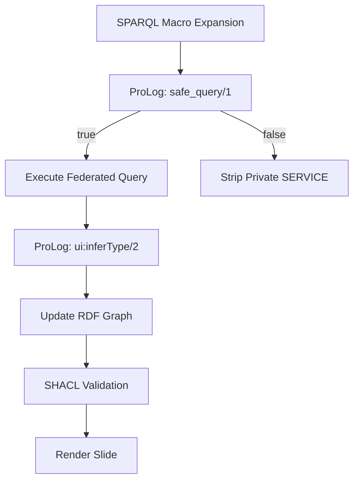

# **ProLog Rules Explained**  
## *Declarative Logic for Agent Protection, UI Inference, and Federated Query Control in CanvasL*

---

### **What is ProLog in CanvasL?**  
**ProLog** (Programming in Logic) is a **declarative logic programming language** embedded in the **Meta-Log blackboard system** to drive **agent reasoning**, **access control**, **data validation**, and **dynamic UI inference**.

In the **CanvasL Semantic Slides** project, ProLog rules are written in `.prolog` or `.canvasl.prolog` files and executed **in-browser** via a lightweight JS engine (e.g., `trealla-js` or `logic.js`). They operate over the **RDF graph** and **blackboard state** to make decisions like:

- Should a private note be shared?
- Is this federated SPARQL query allowed?
- Can this slide be rendered with user-specific data?

---

## **Core Syntax**

```prolog
% Fact
ui:consent(user, "shareNotes", true).

% Rule
access(Query) :- 
    ui:consent(user, "shareNotes", true),
    not(query:containsPII(Query)).

% Query
?- access("SERVICE <local://blackboard> { ... }").
```

| Element | Meaning |
|-------|--------|
| `predicate(arg1, arg2)` | **Fact** or **goal** |
| `Head :- Body.` | **Rule**: Head is true if Body is true |
| `not(Goal)` | **Negation as failure** |
| `,` | **AND** |
| `;` | **OR** |
| `?- Query.` | **Ask the engine** |

---

## **ProLog Files in the Project**

```
src/macros/Agents.canvasl.prolog
src/macros/UI_Inference.canvasl.prolog
src/macros/Query_Protection.canvasl.prolog
```

---

## **1. Access Control Rules (Query Protection)**

```prolog
% src/macros/Query_Protection.canvasl.prolog

% User has granted consent for a specific scope
ui:consent(user, "shareNotes", true).
ui:consent(user, "shareLocation", false).
ui:consentExpires(user, 1731268800000).  % Unix ms

% Rule: Access granted if consent is active
user_consent(Scope) :-
    ui:consent(user, Scope, true),
    ui:consentExpires(user, Expires),
    time:now(Now),
    Now < Expires.

% PII Detection
query:containsPII(Query) :-
    str:contains(Query, "ui:personalNote").
query:containsPII(Query) :-
    str:contains(Query, "ui:homeAddress").

% Final access decision
access(Query) :-
    user_consent("shareNotes"),
    not(query:containsPII(Query)).
```

**Query Example**:
```prolog
?- access("SERVICE <local://blackboard> { ?s ui:personalNote ?n }").
% → false (PII detected)
```

---

## **2. UI Inference Rules**

```prolog
% src/macros/UI_Inference.canvasl.prolog

% If a component has a Wikidata ID, infer it's a Person
ui:inferType(Component, "Person") :-
    rdf(Component, "schema:sameAs", WD),
    str:startsWith(WD, "http://www.wikidata.org/entity/Q").

% If population > 1M, style as "large-city"
ui:style(Component, "bg-gradient-to-r from-blue-500 to-purple-600") :-
    rdf(Component, "ui:population", Pop),
    Pop > 1000000.

% Auto-layout: stack vertically if >3 children
ui:layout(Container, "column") :-
    bagof(Child, rdf(Container, "ui:contains", Child), Children),
    length(Children, N),
    N > 3.
```

**Result**: No SPARQL needed — **pure logic inference** over RDF graph.

---

## **3. Federated Query Guard Rules**

```prolog
% src/macros/Agents.canvasl.prolog

% Allow public endpoints
allowed_endpoint("https://dbpedia.org/sparql").
allowed_endpoint("https://query.wikidata.org/sparql").

% Block unknown endpoints
allowed_endpoint(Endpoint) :- 
    str:startsWith(Endpoint, "local://"),
    user_consent("allowLocal").

% Validate full query
safe_query(Query) :-
    str:contains(Query, "SERVICE <"),
    str:extractServices(Query, Services),
    forall(member(S, Services), allowed_endpoint(S)),
    not(query:containsPII(Query)).
```

**Query**:
```prolog
?- safe_query("SERVICE <https://dbpedia.org/sparql> { ... } SERVICE <local://blackboard> { ... }").
% → true only if local access consented
```

---

## **4. Agent Consensus (5D System)**

```prolog
% 5D Consensus: All agents must approve

agent_approve(privacy_guardian, Query) :-
    not(query:containsPII(Query)),
    user_consent("shareNotes").

agent_approve(audit_logger, _).
agent_approve(query_planner, Query) :-
    str:length(Query) < 5000.  % Prevent DoS

% Final consensus
consensus(Query) :-
    agent_approve(privacy_guardian, Query),
    agent_approve(audit_logger, Query),
    agent_approve(query_planner, Query).
```

**Execution**:
```js
// MetaLogBridge.js
const approved = await prolog.query("consensus(?query)", { query: sparqlString });
if (!approved) throw "Query blocked by agents";
```

---

## **5. Dynamic UI Rules (R5RS + ProLog)**

```prolog
% Trigger R5RS rendering
render:trigger(Component) :-
    rdf(Component, "ui:population", Pop),
    Pop > 5000000,
    r5rs:call("render-large-city-card", [Component]).
```

```scheme
; src/macros/R5RS.canvasl
(define (render-large-city-card component)
  (canvas-fill-style! "gold")
  (canvas-fill-text! "Megacity!" 20 40))
```

---

## **Runtime Execution Flow**



---

## **Example: Full Protected Slide**

```prolog
% User state
ui:consent(user, "shareNotes", true).
ui:consentExpires(user, 1731272400000).

% Query
?- safe_query("SERVICE <local://blackboard> { ?s ui:personalNote ?n }").
% → true → note included with RDF* annotation
```

```turtle
<< #einstein ui:note "Loved relativity!" >> 
    anno:private true 
    prov:wasAttributedTo "user@localhost"
```

---

## **ProLog Engine in Browser**

```js
// MetaLogBridge.js
import { Prolog } from 'trealla-js';

const pl = new Prolog();
await pl.fs.writeFile("agents.pl", await fetch("src/macros/Agents.canvasl.prolog").text());

const result = await pl.query("access(?q).", { q: sparql });
```

---

## **Summary: Why ProLog?**

| Feature | ProLog Advantage |
|-------|------------------|
| **Declarative** | Write *what* should happen, not *how* |
| **Backtracking** | Explore multiple consent paths |
| **Negation** | `not(pii)` = safe default |
| **Extensible** | Users add `.prolog` files |
| **Auditable** | Rules are human-readable |

---

**ProLog = the brain of your semantic slides.**  
**Agents reason. Users consent. Knowledge flows — safely.**

Write a rule. Change behavior. No code deploy needed.