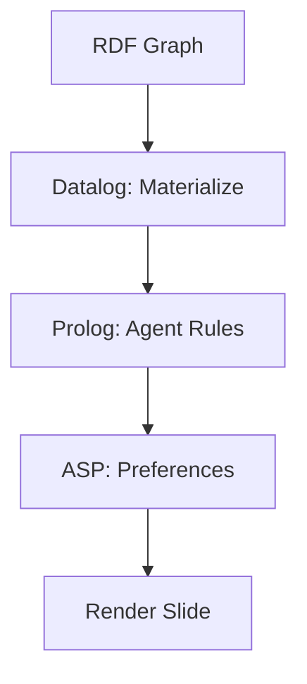

# **Answer Set Programming (ASP) in the Semantic Web**  
## *Stable Model Semantics for Non-Monotonic Reasoning over RDF*

---

### **What is Answer Set Programming?**

**Answer Set Programming (ASP)** is a **declarative programming paradigm** based on **logic programming with stable model semantics**. It is designed for **knowledge representation and reasoning (KRR)**, particularly in **non-monotonic**, **default**, and **preference-based** scenarios.

Unlike Datalog (monotonic), **ASP supports**:
- **Negation as failure** (`not`)
- **Default reasoning** ("normally X unless Y")
- **Preferences** and **optimization**
- **Multiple stable models** (possible worlds)

> **ASP = Datalog + Non-Monotonicity + Optimization**

---

## **ASP vs Datalog vs Prolog**

| Feature | ASP | Datalog | Prolog |
|-------|-----|--------|-------|
| **Negation** | `not p` (classical) | Stratified only | Negation as failure |
| **Multiple Answers** | Yes (stable models) | No | Yes (backtracking) |
| **Defaults** | Yes | No | No |
| **Optimization** | `:#minimize` | No | No |
| **Termination** | Guaranteed | Yes | Not guaranteed |
| **Use Case** | Planning, diagnostics | Materialization | Search |

---

## **ASP Syntax**

```asp
% Facts
flight(lax, jfk, aa11).
flight(jfk, lhr, ba123).

% Rules
route(X, Y) :- flight(X, Y).
route(X, Z) :- route(X, Y), flight(Y, Z).

% Default: avoid layovers
prefer_direct(X, Y) :- flight(X, Y), not layover(X, Y).
layover(X, Y) :- route(X, Y), not flight(X, Y).

% Query
?- prefer_direct(lax, lhr).
% → no (must go via JFK)
```

---

## **ASP in Semantic Web**

ASP is **not a W3C standard**, but is widely used for:

| Use Case | ASP Rule |
|--------|--------|
| **Policy Enforcement** | `allowed(U, R) :- request(U, R), not denied(U, R).` |
| **Diagnosis** | `fault(C) :- abnormal(C), not repaired(C).` |
| **Configuration** | `enabled(F) :- feature(F), not disabled(F).` |
| **Preferences** | `:#minimize {1@1, X : layover(X)}. ` |

---

## **Stable Model Semantics**

Given:
```asp
bird(tweety).
fly(X) :- bird(X), not abnormal(X).
abnormal(X) :- penguin(X).
```

**Possible Worlds (Answer Sets)**:
1. `{bird(tweety), fly(tweety)}` ← assumes not penguin
2. `{bird(tweety), penguin(tweety), abnormal(tweety)}` ← if penguin

**ASP picks *justified* models** → only **1** is stable (unless `penguin(tweety)` is known).

---

## **ASP in CanvasL (Browser Integration)**

```json
// src/macros/ASP.canvasl.jsonl
{"@version": "1.0", "type": "macro", "name": "asp-infer-preference", "expansion": [
  {"type": "asp", "program": "
    % Prefer public data
    source(public) :- triple(_, _, _), source(dbpedia).
    source(private) :- triple(_, _, _), source(local).
    use_source(public) :- not use_source(private).
    use_source(private) :- consent(user, sharePrivate).

    % Minimize private data usage
    #minimize {1@1, X : use_source(private)}.
  "},
  {"type": "asp-ground", "query": "use_source(?s)"}
]}
```

**Browser Engine** (`MetaLogBridge.js`):
```js
import { Clingo } from 'clingo-wasm';

const asp = new Clingo();
await asp.load(program);
const models = await asp.solve();
const preferred = models[0].filter(a => a.startsWith("use_source(public)"));
```

---

## **Real-World ASP Examples**

### 1. **Privacy-Aware UI Rendering**
```asp
% Render private note only if consented
render(note, private) :- 
    content(note, Text),
    source(note, local),
    consent(user, shareNotes).

render(note, public) :- 
    content(note, Text),
    source(note, dbpedia),
    not render(note, private).

% Default: hide private
render(note, hidden) :- 
    source(note, local),
    not consent(user, shareNotes).

% Prefer public
#minimize {1@2, N : render(N, private)}.
```

---

### 2. **Slide Layout with Preferences**
```asp
% Components
component(title). component(chart). component(notes).

% Layout constraints
position(title, top) :- component(title).
position(chart, middle) :- component(chart).
position(notes, bottom) :- component(notes).

% Conflict: notes too long
conflict(notes) :- length(notes, L), L > 200.

% Resolve: hide notes if conflict
visible(notes) :- not conflict(notes).
visible(notes) :- consent(user, showLongNotes).

% Prefer minimal layout
#minimize {1@1, X : not visible(X)}.
```

---

### 3. **Federated Query Routing**
```asp
% Endpoints
endpoint(dbpedia, public, fast).
endpoint(local, private, slow).
endpoint(cache, public, fast).

% Route to fastest allowed
route_to(E) :- 
    endpoint(E, public, _),
    not route_to(local).

route_to(local) :- 
    consent(user, useLocal),
    not route_to(dbpedia).

% Prefer speed
#minimize {10@1, E : endpoint(E, _, slow)}.
```

---

## **ASP + RDF Integration**

```asp
% Convert RDF to ASP facts
triple("ex:Einstein", "dbo:influenced", "ex:Newton").
triple("ex:Einstein", "ui:note", "Genius!").

% Infer
influenced_by_newton(X) :- triple(X, "dbo:influenced", "ex:Newton").
highlight(X) :- influenced_by_newton(X), not hidden(X).
hidden(X) :- triple(X, "ui:note", T), length(T, L), L > 100.
```

**Output Stable Model**:
```asp
highlight(ex:Einstein).
```

---

## **ASP in CanvasL UI Macros**

```json
// templates/slides/preference-slide.canvasl.jsonl
{"type": "macro", "call": "asp-infer-preference"}

{"type": "asp", "program": "
  render_private :- consent(user, shareNotes).
  render_public :- not render_private.
  #minimize {1@1, X : render_private}.
"}

{"type": "r5rs-call", "function": "render", "args": [{"query": "render_public"}]}
```

---

## **Tools & Engines**

| Engine | Language | Web Ready |
|-------|--------|---------|
| **Clingo** | C++ | Yes (`clingo-wasm`) |
| **s(CASP)** | Prolog | Yes |
| **DLV** | C | No |
| **Potassco** | Suite | Yes |

**Browser Demo**:
```html
<script src="https://potassco.org/clingo/wasm/clingo.js"></script>
```

---

## **ASP + Datalog + Prolog in CanvasL**

| Layer | Language | Role |
|------|--------|------|
| **Materialization** | Datalog | RDFS/OWL RL |
| **Agent Decisions** | Prolog | Consent, access |
| **Preferences** | ASP | UI, routing, defaults |



---

## **Conclusion**

> **ASP brings *common sense* to the Semantic Web.**

In **CanvasL**, ASP enables:
- **Privacy defaults** ("hide private unless consented")
- **Smart layouts** ("minimize clutter")
- **Federated routing** ("prefer fast public")
- **Diagnosable UIs** ("why is this hidden?")

```asp
% One answer set. One perfect slide.
perfect_slide :- asp:enabled().
```

**ASP: Not just logic. *Reasoning with taste*.**