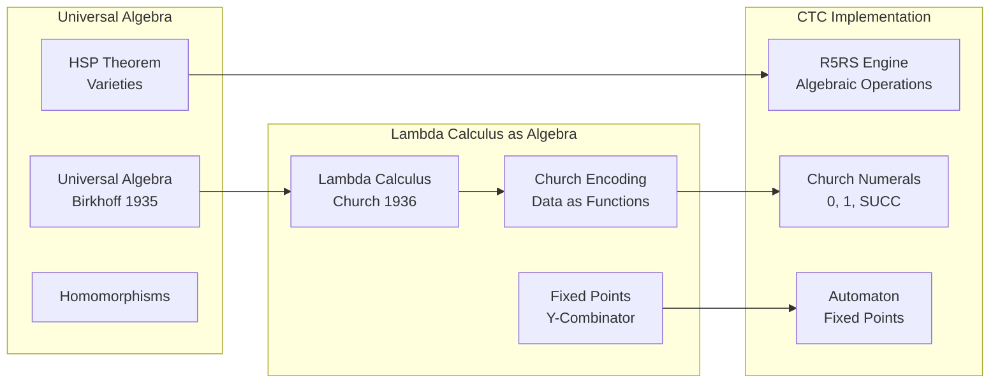

# Algebraic Structures: Universal Algebra and Church Encoding

**From Universal Algebra to Lambda Calculus as Algebra**

---

## Overview

Algebraic structures provide the foundation for understanding computation as algebraic operations. This document covers universal algebra, algebraic topology, and how Church encoding represents computation algebraically, forming the mathematical foundation of CTC's lambda calculus engine.

---

## Foundational Quote

> **"The effective computable functions are those whose values can be 'computed' by a finite procedure; that is, by an algorithm."**
> 
> — Alonzo Church, ["An unsolvable problem of elementary number theory"](https://www.jstor.org/stable/2371045), 1936
> 
> **Why This Matters**: Church's statement establishes lambda calculus as a complete computational model. CTC's R5RS engine implements lambda calculus algebraically—functions are algebraic operations, application is composition, and Church encoding represents all data as algebraic structures. This algebraic view enables CTC to treat computation uniformly across all paradigms.

---

## Historical Context

### 1930s: Universal Algebra (Birkhoff)

**Garrett Birkhoff** developed universal algebra as a general theory of algebraic structures:
- Algebraic structures as sets with operations
- Homomorphisms as structure-preserving maps
- Varieties and equational theories

**Key Insight**: Many mathematical structures share common algebraic properties.

**Paper**: Birkhoff, G. (1935). "On the structure of abstract algebras". Proceedings of the Cambridge Philosophical Society, 31, 433-454.

### 1936: Lambda Calculus as Algebra (Church)

**Alonzo Church** developed lambda calculus, which can be understood algebraically:
- Functions as algebraic operations
- Application as binary operation
- Abstraction as unary operation

**Key Insight**: Computation is algebra - functions are algebraic structures.

**Paper**: Church, A. (1936). "An unsolvable problem of elementary number theory". American Journal of Mathematics, 58, 345-363.

### 1940s-1950s: Algebraic Topology

- **1940s**: Homology and cohomology theories
- **1950s**: Spectral sequences, K-theory
- **1960s**: Category theory applied to topology

### Visual: Algebraic Structures → CTC

**Explanation**: Universal algebra provides the framework for understanding lambda calculus as algebra. CTC's R5RS engine implements this algebraically—functions are operations, Church encoding represents data algebraically, and fixed points enable recursion.

---

## Core Theorems

### Birkhoff's HSP Theorem

**Statement**: A class of algebras is a variety (equational class) if and only if it is closed under:
- **H**omomorphic images
- **S**ubalgebras
- **P**roducts

**Application**: Enables understanding of algebraic structures in CTC through equational theories.

**Reference**: Birkhoff, G. (1935). "On the structure of abstract algebras"

---

### Church-Rosser Theorem

> **"If a term can be reduced to two different terms, then there exists a term to which both can be reduced."**
> 
> — Church, A., & Rosser, J. B. (1936). ["Some properties of conversion"](https://www.jstor.org/stable/2371045)

**Statement**: Beta-reduction in lambda calculus is confluent - reduction order doesn't matter.

**Application**: Enables parallel evaluation in CTC's R5RS engine. This theorem guarantees that CTC agents can evaluate expressions concurrently—the algebraic structure ensures the result is independent of evaluation order.

**Reference**: Church, A., & Rosser, J. B. (1936). "Some properties of conversion"

---

### Fixed-Point Theorem for Lambda Calculus

**Statement**: Every lambda term has a fixed point (via Y-combinator).

**Application**: Enables recursion and self-reference in CTC's automaton system.

**Reference**: Curry, H. B. (1942). "The inconsistency of certain formal logics"

---

## Wikipedia References

### Primary Articles

- ⭐ **[Universal Algebra](https://en.wikipedia.org/wiki/Universal_algebra)** - **Critical**: General theory of algebraic structures. Birkhoff's HSP theorem enables understanding CTC's algebraic operations. This article explains varieties, homomorphisms, and equational theories—all essential to understanding lambda calculus as algebra.

- ⭐ **[Lambda Calculus](https://en.wikipedia.org/wiki/Lambda_calculus)** - **Critical**: Functional computation model that CTC implements. This article explains beta-reduction, Church encoding, and fixed-point combinators—the algebraic foundations of CTC's R5RS engine.

- ⭐ **[Church Encoding](https://en.wikipedia.org/wiki/Church_encoding)** - **Critical**: Data as functions. CTC uses Church encoding for all data structures (numbers, booleans, pairs). This article explains how Church numerals, booleans, and pairs work—fundamental to CTC's data representation.

- **[Algebraic Topology](https://en.wikipedia.org/wiki/Algebraic_topology)** - **Important**: Topology through algebra. Homology groups provide invariants for CTC's dimensional structures. This article explains how algebraic methods analyze topological spaces—relevant to CTC's dimensional progression.

### Related Articles

- **[Algebraic Structure](https://en.wikipedia.org/wiki/Algebraic_structure)** - General algebraic structures
- **[Homomorphism](https://en.wikipedia.org/wiki/Homomorphism)** - Structure-preserving maps
- **[Fixed-Point Combinator](https://en.wikipedia.org/wiki/Fixed-point_combinator)** - Recursion in lambda calculus
- **[Y Combinator](https://en.wikipedia.org/wiki/Fixed-point_combinator)** - Fixed-point combinator

---

## arXiv References

### Foundational Papers

- **Search**: [universal algebra](https://arxiv.org/search/?query=universal+algebra) - Foundational papers
- **Search**: [algebraic topology](https://arxiv.org/search/?query=algebraic+topology) - Topology through algebra
- **Search**: [lambda calculus](https://arxiv.org/search/?query=lambda+calculus) - Lambda calculus foundations
- **Search**: [Church encoding](https://arxiv.org/search/?query=Church+encoding) - Church encoding theory

### Computational Applications

- **Search**: [computational algebra](https://arxiv.org/search/?query=computational+algebra) - Algebra in computation
- **Search**: [functional programming algebra](https://arxiv.org/search/?query=functional+programming+algebra) - FP as algebra
- **Search**: [algebraic effects](https://arxiv.org/search/?query=algebraic+effects) - Effects as algebra

---

## Connection to CTC

### How Algebraic Structures Enable CTC

**1. Lambda Calculus as Algebra**
- **Functions as Operations**: CTC's R5RS functions are algebraic operations
- **Application as Binary Operation**: Function application is algebraic composition
- **Abstraction as Unary Operation**: Lambda abstraction creates operations

**2. Church Encoding**
- **Numbers as Functions**: CTC uses Church numerals for computation
- **Data as Functions**: All data structures encoded as functions
- **Operations as Functions**: Arithmetic operations are function compositions

**3. Fixed-Point Algebra**
- **Y-Combinator**: CTC uses Y-combinator for recursion
- **Self-Reference**: Automaton self-reference via fixed points
- **Evolution**: System evolution converges to fixed points

**4. Algebraic Topology**
- **Homology**: CTC's dimensional structure has algebraic topology
- **Fiber Bundles**: Dimensional progression as fiber bundles
- **Cohomology**: Knowledge structures have cohomological properties

### Specific CTC Applications

**System/0D-system/R5RS_Integration.md**:
- Church encoding primitives (zero, one, succ)
- Lambda calculus as algebraic operations
- Fixed-point combinators (Y-combinator)

**Topology/0D-topology/Church_Encoding.md**:
- Church numerals as algebraic structures
- Church booleans as algebraic operations
- Church pairs as algebraic products

**System/0D-system/Automaton_System.md**:
- Self-reference via fixed-point algebra
- Evolution as algebraic transformation
- Convergence as fixed-point finding

---

## Prerequisites

**Before understanding algebraic structures**:
- Set theory
- Basic group theory
- Function composition

**Learning Path**:
1. Set theory → Groups → Universal algebra
2. Functions → Lambda calculus → Church encoding
3. Topology → Algebraic topology → Computational topology

---

## Enables

**Understanding algebraic structures enables**:
- **Category Theory**: See `category-theory.md` - Categories of algebras
- **Polynomial Theories**: See `polynomial-theories.md` - Polynomial algebras
- **Gap Bridging**: See `gap-bridging.md` - Algebra → computation

---

## Key Concepts

### Universal Algebra

- **Algebraic Structure**: Set with operations
- **Homomorphism**: Structure-preserving map
- **Variety**: Equational class of algebras
- **Free Algebra**: Universal construction

### Lambda Calculus Algebra

- **Lambda Term**: Algebraic expression
- **Beta-Reduction**: Algebraic simplification
- **Church Encoding**: Data as algebraic structures
- **Fixed-Point**: Solution to algebraic equation

### Algebraic Topology

- **Homology Group**: Algebraic invariant of topology
- **Cohomology**: Dual of homology
- **Fundamental Group**: Algebraic structure of loops
- **Fiber Bundle**: Topological structure with algebraic properties

---

## Related Theories

- **Category Theory**: See `category-theory.md` - Categories of algebraic structures
- **Polynomial Theories**: See `polynomial-theories.md` - Polynomial rings as algebras
- **Topological Foundations**: See `topological-foundations.md` - Algebraic topology
- **Gap Bridging**: See `gap-bridging.md` - Algebra → computation

---

**Last Updated**: 2025-01-07  
**Version**: 1.0.0  
**Status**: Complete
