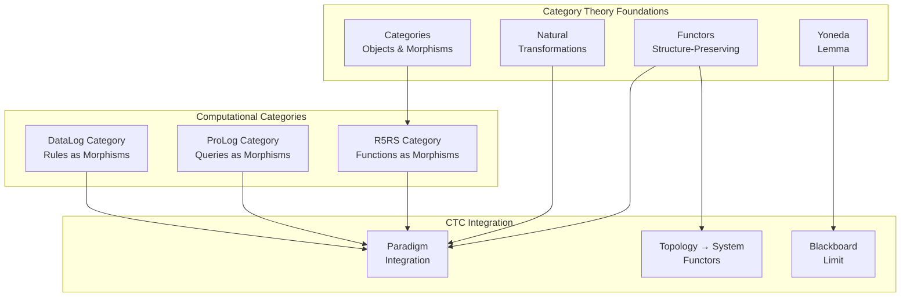

# Category Theory: The Mathematics of Structure and Relationships

**From Eilenberg-Mac Lane to Computational Categories**

---

## Overview

Category theory provides a unified mathematical framework for understanding structure and relationships across mathematics and computation. This document covers the foundations from Eilenberg-Mac Lane's original work through computational applications that enable CTC's structural organization.

---

## Foundational Quote

> **"The notion of category is designed to express that the mathematical structure of a given type is essentially determined by the system of all mappings of that structure into structures of the same type."**
> 
> — Samuel Eilenberg & Saunders Mac Lane, ["General theory of natural equivalences"](https://www.jstor.org/stable/1990284), 1945
> 
> **Why This Matters**: This statement captures category theory's fundamental insight—structures are determined by their relationships (morphisms), not just internal properties. CTC's knowledge representation follows this principle: knowledge nodes are determined by their relationships (edges), exactly as the Yoneda lemma predicts. This enables CTC's paradigm integration—different computational paradigms (R5RS, ProLog, DataLog) form categories, and CTC integrates them functorially.

---

## Historical Context

### 1940s: Category Theory Emerges

**Samuel Eilenberg** and **Saunders Mac Lane** developed category theory to unify algebraic topology:
- Categories as collections of objects and morphisms
- Functors as structure-preserving maps
- Natural transformations as morphisms between functors

**Key Insight**: Mathematical structures can be understood through their relationships, not just their internal properties.

**Paper**: Eilenberg, S., & Mac Lane, S. (1945). "General theory of natural equivalences". Transactions of the American Mathematical Society, 58(2), 231-294.

### 1950s-1960s: Development

- **1950s**: Abelian categories, homological algebra
- **1960s**: Topos theory (Grothendieck)
- **1970s**: Elementary topos theory (Lawvere, Tierney)

### 1980s-Present: Computational Applications

- **1980s**: Category theory applied to programming languages
- **1990s**: Computational categories, monads in programming
- **2000s**: Homotopy type theory, univalent foundations
- **2010s**: Applied category theory, categorical foundations

### Visual: Category Theory → CTC Integration



**Explanation**: Category theory provides the framework for CTC's paradigm integration. Each paradigm (R5RS, ProLog, DataLog) forms a category, and CTC integrates them through functors and natural transformations. The Yoneda lemma shows knowledge is determined by relationships—fundamental to CTC's blackboard architecture.

---

## Core Theorems

### Yoneda Lemma

> **"An object is completely determined by its relationships to all other objects."**
> 
> — Nobuo Yoneda, ["On the homology theory of modules"](https://www.jstage.jst.go.jp/article/jfsms1949/7/0/7_0_193/_article), 1954

**Statement**: Objects are completely determined by their relationships to all other objects.

**Formal**: For any functor F: C^op → Set and object c in C, there is a natural isomorphism:
```
Nat(C(-, c), F) ≅ F(c)
```

**Application**: Enables knowledge representation through relationships in CTC. CTC's knowledge nodes are determined by their relationships (edges), not just internal properties—exactly what Yoneda predicts. This is why CTC's RDF knowledge graphs work: nodes are defined by their triple relationships.

**Reference**: Yoneda, N. (1954). "On the homology theory of modules". Journal of the Faculty of Science, University of Tokyo, 7, 193-227.

---

### Adjoint Functor Theorem

**Statement**: Under certain conditions, functors have adjoints (universal constructions).

**Application**: Enables universal constructions in CTC, such as free knowledge structures.

**Reference**: Freyd, P. J. (1964). "Abelian categories"

---

### Grothendieck's Relative Point of View

**Statement**: Objects should be studied relative to a base category, not in isolation.

**Application**: Enables CTC's dimensional progression - each dimension studied relative to previous dimensions.

**Reference**: Grothendieck, A. (1960). "Éléments de géométrie algébrique"

---

## Wikipedia References

### Primary Articles

- ⭐ **[Category Theory](https://en.wikipedia.org/wiki/Category_theory)** - **Critical**: Unified framework enabling CTC's paradigm integration. The Yoneda lemma shows objects are determined by relationships—fundamental to CTC's knowledge representation. This article explains categories, functors, and natural transformations—all essential to understanding how CTC integrates R5RS, ProLog, and DataLog.

- ⭐ **[Functor](https://en.wikipedia.org/wiki/Functor)** - **Critical**: Structure-preserving maps between categories. CTC's topology→system mappings are functors—they preserve mathematical structure while enabling computation. Functor composition enables CTC's multi-paradigm integration.

- **[Natural Transformation](https://en.wikipedia.org/wiki/Natural_transformation)** - **Important**: Morphisms between functors. CTC's paradigm translations are natural transformations—they enable seamless conversion between R5RS, ProLog, and DataLog while preserving semantics.

- **[Topos Theory](https://en.wikipedia.org/wiki/Topos)** - **Important**: Generalization of set theory. CTC's validation framework can be understood through topos theory—the subobject classifier enables constraint checking. Logic in topoi provides foundations for CTC's ProLog/DataLog integration.

### Related Articles

- **[Homotopy Type Theory](https://en.wikipedia.org/wiki/Homotopy_type_theory)** - Type theory with topological foundations
- **[Monad (Category Theory)](https://en.wikipedia.org/wiki/Monad_(category_theory))** - Monads in category theory
- **[Adjoint Functors](https://en.wikipedia.org/wiki/Adjoint_functors)** - Universal constructions
- **[Computational Category Theory](https://en.wikipedia.org/wiki/Category_theory)** - Category theory in computation

---

## arXiv References

### Foundational Papers

- **Search**: [category theory](https://arxiv.org/search/?query=category+theory) - Foundational papers
- **Search**: [functor](https://arxiv.org/search/?query=functor) - Functor theory
- **Search**: [topos theory](https://arxiv.org/search/?query=topos+theory) - Topos foundations
- **Search**: [homotopy type theory](https://arxiv.org/search/?query=homotopy+type+theory) - HoTT research

### Computational Applications

- **Search**: [computational category theory](https://arxiv.org/search/?query=computational+category+theory) - Category theory in computation
- **Search**: [applied category theory](https://arxiv.org/search/?query=applied+category+theory) - Applications
- **Search**: [categorical programming](https://arxiv.org/search/?query=categorical+programming) - Programming with categories
- **Search**: [monad programming](https://arxiv.org/search/?query=monad+programming) - Monads in programming

---

## Connection to CTC

### How Category Theory Enables CTC

**1. Structural Organization**
- **Categories**: CTC's dimensions form categories (0D, 1D, 2D, ...)
- **Morphisms**: Dimensional progression as morphisms
- **Functors**: Topology → System mappings as functors

**2. Universal Constructions**
- **Limits**: CTC's blackboard as limit (product) of knowledge
- **Colimits**: CTC's automaton evolution as colimit
- **Adjunctions**: Free constructions in CTC

**3. Computational Categories**
- **Lambda Calculus as Category**: CTC's R5RS functions form a category
- **Monads**: CTC's effectful computations as monads
- **Natural Transformations**: Paradigm translations in CTC

**4. Topos Structure**
- **Subobject Classifier**: CTC's validation as subobject classifier
- **Logic in Topos**: CTC's ProLog/DataLog as topos logic
- **Sheaves**: CTC's knowledge as sheaves

### Specific CTC Applications

**Horizontal Integration**:
- Topology ↔ System mappings as functors between categories
- Paradigm integration as natural transformations

**Vertical Progression**:
- Dimensional chain as functor: 0D → 1D → 2D → ...
- Each dimension as category with morphisms

**Bipartite Structure**:
- Left partition (Topology) and right partition (System) as categories
- Horizontal edges as functors between partitions

---

## Prerequisites

**Before understanding category theory**:
- Set theory
- Abstract algebra (groups, rings, modules)
- Basic topology

**Learning Path**:
1. Set theory → Categories → Functors
2. Abstract algebra → Universal algebra → Category theory
3. Topology → Algebraic topology → Topos theory

---

## Enables

**Understanding category theory enables**:
- **Algebraic Structures**: See `algebraic-structures.md` - Categories of algebras
- **Topological Foundations**: See `topological-foundations.md` - Topos theory
- **Gap Bridging**: See `gap-bridging.md` - Category theory → computation

---

## Key Concepts

### Basic Definitions

- **Category**: Collection of objects and morphisms with composition
- **Functor**: Structure-preserving map between categories
- **Natural Transformation**: Morphism between functors
- **Limit/Colimit**: Universal constructions

### Computational Categories

- **Category of Types**: Types as objects, functions as morphisms
- **Monad**: Endofunctor with unit and multiplication
- **Comonad**: Dual of monad
- **Applicative Functor**: Weaker than monad

### Topos Theory

- **Elementary Topos**: Category with subobject classifier
- **Grothendieck Topos**: Sheaf category
- **Logic in Topos**: Intuitionistic logic

---

## Related Theories

- **Algebraic Structures**: See `algebraic-structures.md` - Categories of algebraic structures
- **Topological Foundations**: See `topological-foundations.md` - Topos theory
- **Polynomial Theories**: See `polynomial-theories.md` - Categories of polynomial functors
- **Gap Bridging**: See `gap-bridging.md` - Category theory → programming languages

---

**Last Updated**: 2025-01-07  
**Version**: 1.0.0  
**Status**: Complete
