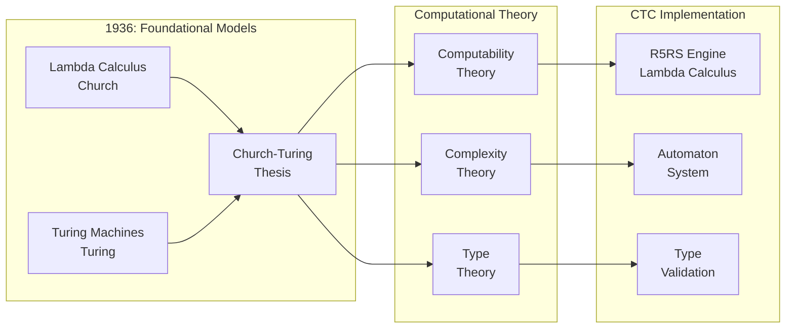

# Computational Theory: Lambda Calculus, Computability, and Complexity

**From Church-Turing to Computational Foundations**

---

## Overview

Computational theory provides the mathematical foundation for understanding computation, computability, and complexity. This document covers lambda calculus, computability theory, complexity theory, and type theory that form the computational foundation of CTC's R5RS engine and automaton system.

---

## Foundational Quote

> **"The effective computable functions are those whose values can be 'computed' by a finite procedure; that is, by an algorithm."**
> 
> — Alonzo Church, ["An unsolvable problem of elementary number theory"](https://www.jstor.org/stable/2371045), 1936
> 
> **Why This Matters**: This statement establishes lambda calculus as a complete model of computation. CTC's R5RS engine implements lambda calculus, making it Turing-complete and capable of computing any computable function. This foundational equivalence enables CTC to integrate with other computational models (Turing machines, logic programming) knowing they all compute the same class of functions.

---

## Historical Context

### 1936: Lambda Calculus (Church)

**Alonzo Church** developed lambda calculus:
- Functions as computation
- Lambda abstraction and application
- Church encoding of data

**Key Insight**: Computation can be formalized through functions alone.

**Paper**: Church, A. (1936). "An unsolvable problem of elementary number theory". American Journal of Mathematics, 58, 345-363.

### 1936: Turing Machines (Turing)

**Alan Turing** developed Turing machines:
- Abstract computation model
- Universal computation
- Halting problem

**Key Insight**: Computation can be mechanized.

**Paper**: Turing, A. M. (1936). "On computable numbers, with an application to the Entscheidungsproblem". Proceedings of the London Mathematical Society, 42, 230-265.

### 1936: Church-Turing Thesis

**Statement**: Lambda calculus and Turing machines define the same class of computable functions.

**Key Insight**: Computation is universal - all models are equivalent.

### Visual: Computational Theory Foundations

**Explanation**: Church-Turing thesis establishes equivalence of computation models. CTC implements lambda calculus (R5RS), inheriting all computational power and limits.

---

## Core Theorems

### Church-Rosser Theorem

> **"If a term can be reduced to two different terms, then there exists a term to which both can be reduced."**
> 
> — Church, A., & Rosser, J. B. (1936). ["Some properties of conversion"](https://www.jstor.org/stable/2371045)

**Statement**: Beta-reduction in lambda calculus is confluent - reduction order doesn't matter.

**Application**: Enables parallel evaluation in CTC's R5RS engine. This theorem guarantees that CTC agents can evaluate expressions concurrently without coordination—the result is independent of evaluation order.

**Reference**: Church, A., & Rosser, J. B. (1936). "Some properties of conversion"

---

### Undecidability of Halting Problem

> **"It is impossible to decide algorithmically whether a given program will halt or run forever."**
> 
> — Alan Turing, ["On computable numbers"](https://www.cs.virginia.edu/~robins/Turing_Paper_1936.pdf), 1936

**Statement**: There is no algorithm that can determine if a program halts.

**Application**: Establishes limits of CTC's automaton system - some questions are undecidable. CTC respects these fundamental limits, recognizing that not all properties can be computed.

**Reference**: Turing, A. M. (1936). "On computable numbers"

---

### Curry-Howard Correspondence

> **"There is a direct correspondence between types and propositions, and between programs and proofs."**
> 
> — Curry, H. B., & Feys, R. (1958). ["Combinatory Logic"](https://www.worldcat.org/title/combinatory-logic/oclc/523470)

**Statement**: There is an isomorphism between:
- Types ↔ Propositions
- Programs ↔ Proofs
- Type checking ↔ Proof checking

**Application**: Enables CTC's type systems and validation. When CTC validates types, it's effectively checking proofs—this correspondence provides mathematical rigor to CTC's validation framework.

**Reference**: Curry, H. B., & Feys, R. (1958). "Combinatory Logic"

---

## Wikipedia References

### Primary Articles

- ⭐ **[Lambda Calculus](https://en.wikipedia.org/wiki/Lambda_calculus)** - **Critical**: Functional computation model. CTC's R5RS engine is lambda calculus. This article explains beta-reduction, Church encoding, and fixed-point combinators—all essential to CTC.

- ⭐ **[Computability Theory](https://en.wikipedia.org/wiki/Computability_theory)** - **Critical**: What can be computed. Establishes fundamental limits (halting problem) that CTC respects. Understanding computability is essential for knowing what CTC can and cannot do.

- **[Complexity Theory](https://en.wikipedia.org/wiki/Computational_complexity_theory)** - **Important**: How hard computation is. CTC analyzes complexity for optimization. P vs NP and complexity classes guide CTC's algorithm design.

- **[Type Theory](https://en.wikipedia.org/wiki/Type_theory)** - **Important**: Types and computation. Curry-Howard correspondence enables CTC's type validation as proof checking. Type systems ensure CTC's correctness.

### Related Articles

- **[Turing Machine](https://en.wikipedia.org/wiki/Turing_machine)** - Abstract computation model
- **[Church-Turing Thesis](https://en.wikipedia.org/wiki/Church%E2%80%93Turing_thesis)** - Equivalence of computation models
- **[Curry-Howard Correspondence](https://en.wikipedia.org/wiki/Curry%E2%80%93Howard_correspondence)** - Types as propositions
- **[Proof Theory](https://en.wikipedia.org/wiki/Proof_theory)** - Structure of proofs

---

## arXiv References

### Foundational Papers

- **Search**: [lambda calculus](https://arxiv.org/search/?query=lambda+calculus) - Lambda calculus foundations
- **Search**: [computability theory](https://arxiv.org/search/?query=computability+theory) - Computability
- **Search**: [complexity theory](https://arxiv.org/search/?query=complexity+theory) - Complexity
- **Search**: [type theory](https://arxiv.org/search/?query=type+theory) - Type systems

### Recent Developments

- **Search**: [homotopy type theory](https://arxiv.org/search/?query=homotopy+type+theory) - HoTT research
- **Search**: [computational complexity](https://arxiv.org/search/?query=computational+complexity) - Complexity research
- **Search**: [programming language theory](https://arxiv.org/search/?query=programming+language+theory) - PL theory

---

## Connection to CTC

### How Computational Theory Enables CTC

**1. Lambda Calculus Foundation**
- **R5RS Engine**: CTC's R5RS functions are lambda calculus
- **Church Encoding**: CTC uses Church encoding for all data
- **Beta-Reduction**: CTC's evaluation is beta-reduction

**2. Computability Guarantees**
- **Turing Completeness**: CTC's R5RS engine is Turing complete
- **Computable Functions**: CTC can compute any computable function
- **Undecidability Limits**: CTC respects computational limits

**3. Type Systems**
- **Type Checking**: CTC validates types
- **Type Inference**: CTC infers types
- **Curry-Howard**: CTC's validation as proof checking

**4. Complexity Analysis**
- **Time Complexity**: CTC analyzes computation time
- **Space Complexity**: CTC manages memory
- **Optimization**: CTC optimizes based on complexity

### Specific CTC Applications

**System/0D-system/R5RS_Integration.md**:
- Lambda calculus implementation
- Church encoding primitives
- Beta-reduction engine

**System/0D-system/Automaton_System.md**:
- Computable automaton operations
- Self-reference via fixed points
- Evolution as computation

**Topology/0D-topology/Church_Encoding.md**:
- Church encoding theory
- Lambda calculus foundations
- Computational foundations

---

## Prerequisites

**Before understanding computational theory**:
- Set theory
- Basic logic
- Functions and recursion

**Learning Path**:
1. Functions → Lambda calculus → Computability
2. Logic → Type theory → Curry-Howard
3. Algorithms → Complexity → Complexity theory

---

## Enables

**Understanding computational theory enables**:
- **Algebraic Structures**: See `algebraic-structures.md` - Lambda calculus as algebra
- **Category Theory**: See `category-theory.md` - Categories of computations
- **Gap Bridging**: See `gap-bridging.md` - Computation → implementation

---

## Key Concepts

### Lambda Calculus

- **Lambda Term**: Expression in lambda calculus
- **Abstraction**: Creating functions (λx.t)
- **Application**: Calling functions (t₁ t₂)
- **Beta-Reduction**: Function application

### Computability

- **Computable Function**: Function computable by algorithm
- **Turing Machine**: Abstract computation model
- **Halting Problem**: Undecidable problem
- **Recursive Functions**: Computable functions

### Complexity

- **Time Complexity**: How long computation takes
- **Space Complexity**: How much memory needed
- **P vs NP**: Major open problem
- **Complexity Classes**: Classes of problems

---

## Related Theories

- **Algebraic Structures**: See `algebraic-structures.md` - Lambda calculus as algebra
- **Category Theory**: See `category-theory.md` - Categories of computations
- **Topological Foundations**: See `topological-foundations.md` - Computational topology
- **Gap Bridging**: See `gap-bridging.md` - Theory → implementation

---

**Last Updated**: 2025-01-07  
**Version**: 1.0.0  
**Status**: Complete
