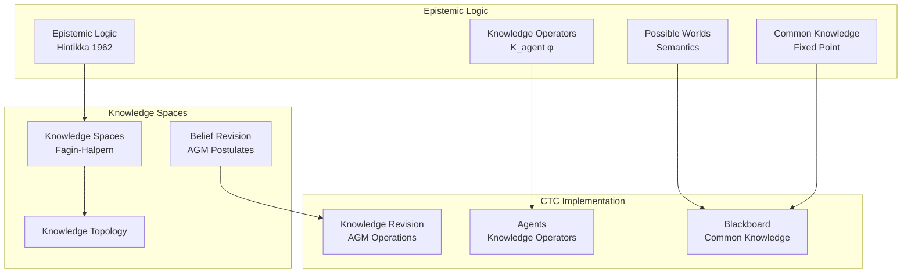

# Epistemic Topologies: Knowledge Spaces and Multi-Agent Belief

**From Epistemic Logic to Knowledge Topologies**

---

## Overview

Epistemic topologies provide the mathematical foundation for understanding knowledge, belief, and multi-agent knowledge systems. This document covers epistemic logic, knowledge spaces, belief revision, and how these enable CTC's multi-agent system and blackboard architecture.

---

## Foundational Quote

> **"Knowledge and belief are two different notions, and both can be formalized using modal logic with possible worlds semantics."**
> 
> — Jaakko Hintikka, ["Knowledge and Belief: An Introduction to the Logic of the Two Notions"](https://www.jstor.org/stable/2183682), 1962
> 
> **Why This Matters**: Hintikka's formalization of knowledge through possible worlds enables CTC's multi-agent system. CTC's agents have knowledge (K_agent φ), and the blackboard maintains common knowledge—knowledge that everyone knows, everyone knows everyone knows, etc. This epistemic foundation ensures CTC's multi-agent coordination is mathematically rigorous.

---

## Historical Context

### 1960s: Epistemic Logic (Hintikka)

**Jaakko Hintikka** developed epistemic logic:
- Knowledge operators (Kφ: "agent knows φ")
- Possible worlds semantics
- Knowledge and belief logic

**Key Insight**: Knowledge can be formalized logically through possible worlds.

**Paper**: Hintikka, J. (1962). "Knowledge and Belief: An Introduction to the Logic of the Two Notions"

### 1980s: Knowledge Spaces (Fagin, Halpern)

**Ronald Fagin** and **Joseph Halpern** developed knowledge spaces:
- Knowledge structures
- Common knowledge
- Distributed knowledge

**Key Insight**: Multi-agent knowledge can be modeled topologically.

**Paper**: Fagin, R., & Halpern, J. Y. (1988). "Belief, awareness, and limited reasoning"

### 1990s: Belief Revision (AGM)

**Alchourrón, Gärdenfors, and Makinson** developed belief revision:
- AGM postulates
- Belief change operations
- Epistemic entrenchment

**Key Insight**: Knowledge can be revised consistently.

**Paper**: Alchourrón, C. E., Gärdenfors, P., & Makinson, D. (1985). "On the logic of theory change"

### Visual: Epistemic Logic → CTC Multi-Agent System

**Explanation**: Epistemic logic provides the foundation. CTC's agents are knowledge operators (K_agent), the blackboard maintains common knowledge (greatest fixed point), and knowledge updates follow AGM postulates. This ensures CTC's multi-agent coordination is epistemically sound.

---

## Core Theorems

### Possible Worlds Semantics

**Statement**: Knowledge is modeled through possible worlds - agent knows φ if φ is true in all worlds agent considers possible.

**Application**: Enables CTC's multi-agent knowledge through possible worlds.

**Reference**: Kripke, S. (1963). "Semantical considerations on modal logic"

---

### Common Knowledge Theorem

> **"Common knowledge is the greatest fixed point of the knowledge operators—it is knowledge that everyone knows, everyone knows everyone knows, and so on ad infinitum."**
> 
> — Robert J. Aumann, ["Agreeing to disagree"](https://www.jstor.org/stable/2951491), 1976

**Statement**: Common knowledge (everyone knows, everyone knows everyone knows, ...) is the greatest fixed point of knowledge operators.

**Application**: Enables CTC's blackboard as common knowledge space. CTC's blackboard maintains common knowledge—knowledge that all agents share. This fixed-point characterization ensures CTC's multi-agent coordination is mathematically well-defined.

**Reference**: Aumann, R. J. (1976). "Agreeing to disagree"

---

### AGM Belief Revision Postulates

**Statement**: Belief revision satisfies:
1. Success: Revised belief contains new information
2. Inclusion: Revision doesn't add unnecessary information
3. Vacuity: If consistent, revision is union
4. Extensionality: Equivalent formulas treated equally

**Application**: Enables CTC's knowledge update and revision.

**Reference**: Alchourrón, C. E., et al. (1985). "On the logic of theory change"

---

## Wikipedia References

### Primary Articles

- ⭐ **[Epistemic Logic](https://en.wikipedia.org/wiki/Epistemic_logic)** - **Critical**: Logic of knowledge. CTC's agents have knowledge (K_agent φ), and the blackboard maintains common knowledge. This article explains knowledge operators, possible worlds semantics, and multi-agent knowledge—all essential to understanding CTC's multi-agent system.

- ⭐ **[Multi-Agent System](https://en.wikipedia.org/wiki/Multi-agent_system)** - **Critical**: Multiple agents coordinating. CTC implements a multi-agent system where agents coordinate through shared knowledge. This article explains agent coordination, communication protocols, and knowledge sharing—fundamental to CTC's architecture.

- ⭐ **[Belief Revision](https://en.wikipedia.org/wiki/Belief_revision)** - **Critical**: Changing beliefs consistently. CTC's knowledge updates follow AGM postulates, ensuring consistent belief revision. This article explains AGM postulates and belief change operations—essential to CTC's knowledge management.

- **[Knowledge Space](https://en.wikipedia.org/wiki/Knowledge_space)** - **Important**: Topological knowledge structures. CTC's knowledge can be understood as a knowledge space with topological structure. This article explains knowledge structures and common knowledge—relevant to CTC's blackboard architecture.

### Related Articles

- **[Modal Logic](https://en.wikipedia.org/wiki/Modal_logic)** - Logic of necessity and possibility
- **[Possible Worlds](https://en.wikipedia.org/wiki/Possible_world)** - Semantics for modal logic
- **[Common Knowledge](https://en.wikipedia.org/wiki/Common_knowledge_(logic))** - Shared knowledge
- **[Blackboard System](https://en.wikipedia.org/wiki/Blackboard_system)** - Shared knowledge architecture

---

## arXiv References

### Foundational Papers

- **Search**: [epistemic logic](https://arxiv.org/search/?query=epistemic+logic) - Foundational papers
- **Search**: [belief revision](https://arxiv.org/search/?query=belief+revision) - Belief change
- **Search**: [knowledge representation](https://arxiv.org/search/?query=knowledge+representation) - Knowledge systems
- **Search**: [multi-agent knowledge](https://arxiv.org/search/?query=multi-agent+knowledge) - MAS knowledge

### Recent Developments

- **Search**: [epistemic game theory](https://arxiv.org/search/?query=epistemic+game+theory) - Knowledge in games
- **Search**: [distributed knowledge](https://arxiv.org/search/?query=distributed+knowledge) - Distributed systems
- **Search**: [knowledge graphs](https://arxiv.org/search/?query=knowledge+graphs) - Graph knowledge

---

## Connection to CTC

### How Epistemic Topologies Enable CTC

**1. Multi-Agent Knowledge**
- **Agent Knowledge**: Each CTC agent has knowledge
- **Common Knowledge**: Blackboard as common knowledge space
- **Distributed Knowledge**: Knowledge distributed across agents

**2. Knowledge Spaces**
- **Topological Structure**: CTC's knowledge as topological space
- **Knowledge Operators**: CTC's agents as knowledge operators
- **Possible Worlds**: CTC's knowledge states as possible worlds

**3. Belief Revision**
- **Knowledge Updates**: CTC's blackboard updates as belief revision
- **Consistency**: CTC maintains knowledge consistency
- **Revision Operations**: CTC's automaton evolution as revision

**4. Blackboard Architecture**
- **Shared Knowledge**: Blackboard as epistemic space
- **Agent Coordination**: Agents coordinate through shared knowledge
- **Knowledge Propagation**: Knowledge propagates through blackboard

### Specific CTC Applications

**System/5D-system/Blackboard_Architecture.md**:
- Blackboard as epistemic space
- Agents as knowledge operators
- Knowledge coordination through blackboard

**System/4D-system/Multi_Agent_System.md**:
- Multi-agent knowledge system
- Agent communication protocols
- Distributed knowledge coordination

**Topology/5D-topology/5D_Consensus_Agent.md**:
- Consensus through knowledge agreement
- Voting as knowledge aggregation
- Agreement protocols

---

## Prerequisites

**Before understanding epistemic topologies**:
- Modal logic basics
- Set theory
- Topology basics

**Learning Path**:
1. Modal logic → Epistemic logic → Knowledge spaces
2. Set theory → Topology → Knowledge topologies
3. Logic → Belief revision → Knowledge update

---

## Enables

**Understanding epistemic topologies enables**:
- **Computational Theory**: See `computational-theory.md` - Knowledge computation
- **Relational Theories**: See `relational-theories.md` - Knowledge representation
- **Gap Bridging**: See `gap-bridging.md` - Epistemic logic → multi-agent systems

---

## Key Concepts

### Epistemic Logic

- **Knowledge Operator**: Kφ ("agent knows φ")
- **Belief Operator**: Bφ ("agent believes φ")
- **Possible Worlds**: Worlds agent considers possible
- **Accessibility Relation**: Relation between worlds

### Knowledge Spaces

- **Knowledge Structure**: Set of knowledge states
- **Common Knowledge**: Everyone knows, everyone knows everyone knows, ...
- **Distributed Knowledge**: Combined knowledge of all agents
- **Knowledge Topology**: Topological structure on knowledge

### Belief Revision

- **Expansion**: Adding new information
- **Revision**: Changing beliefs consistently
- **Contraction**: Removing information
- **Epistemic Entrenchment**: Ordering of beliefs

---

## Related Theories

- **Computational Theory**: See `computational-theory.md` - Knowledge computation
- **Relational Theories**: See `relational-theories.md` - Knowledge representation
- **Topological Foundations**: See `topological-foundations.md` - Knowledge topologies
- **Gap Bridging**: See `gap-bridging.md` - Epistemic logic → computation

---

**Last Updated**: 2025-01-07  
**Version**: 1.0.0  
**Status**: Complete
