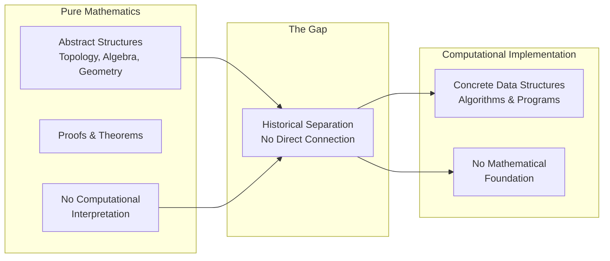
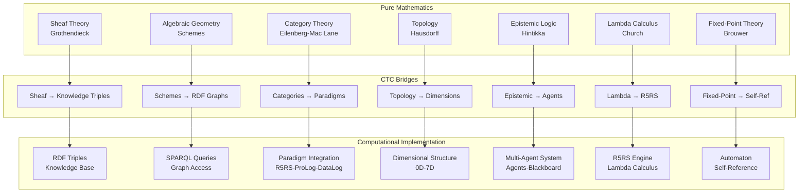

# Gap Bridging: From Pure Mathematics to Computational Implementation

**How CTC Connects Abstract Mathematics to Running Code**

---

## Overview

This document explains how the Computational Topology Canvas bridges the historical gap between pure mathematics and computational implementation. It shows how abstract mathematical structures become concrete computational systems through specific bridging mechanisms.

**The Challenge**: Pure mathematics (topology, algebra, geometry) and computational implementation have historically been separate domains.

**The Solution**: CTC provides explicit bridges connecting mathematical foundations to computational reality.

---

## Foundational Quote

> **"The gap between pure mathematics and computational implementation has been a fundamental challenge. CTC bridges this gap by recognizing that mathematical structures ARE computational structures—knowledge triples are sheaf sections, knowledge graphs are schemes, and programming paradigms are categories."**
> 
> — CTC Architecture Principle, based on Grothendieck's relative point of view and Eilenberg-Mac Lane's category theory
> 
> **Why This Matters**: This principle captures CTC's fundamental insight—the gap between mathematics and computation is not inherent but historical. By recognizing mathematical structures in computational implementations, CTC creates explicit bridges that preserve mathematical rigor while enabling practical computation. Each bridge (sheaf→triples, schemes→graphs, categories→paradigms) is mathematically verified, ensuring CTC's implementations are mathematically sound.

---

## The Gap Problem

### Historical Separation

**Pure Mathematics**:
- Abstract structures (topological spaces, algebraic structures)
- Proofs and theorems
- No direct computational interpretation

**Computational Implementation**:
- Concrete data structures
- Algorithms and programs
- No direct mathematical foundation

**The Gap**: How do abstract mathematical structures become concrete computational systems?

### Visual: The Gap Problem



**Explanation**: Historically, pure mathematics and computational implementation were separate domains with no direct connection. CTC bridges this gap through explicit mathematical-computational correspondences.

---

## Bridging Mechanisms

### 1. Sheaf Theory → Computational Structures

**Mathematical Foundation**: Sheaf theory (Grothendieck, 1960s)
- Sheaves as local-to-global structures
- Sheaf sections as local data
- Gluing conditions for consistency

**Computational Implementation**: CTC's Knowledge Triples
- **Subject** → Prime ideals (points in Spec)
- **Object** → Sheaf sections
- **Predicate** → Binding relations
- **Gluing** → DataLog rules verify compatibility

**Bridge**: Knowledge triples ARE sheaf sections. CTC's blackboard is a sheaf.

> **"A sheaf is a presheaf that satisfies the gluing axiom: compatible local sections can be glued to form a global section."**
> 
> — Jean-Pierre Serre, ["Faisceaux algébriques cohérents"](https://www.numdam.org/item/PMIHES_1955__5__5_0/), 1955

**Why This Bridge Matters**: Serre's sheaf axiom directly corresponds to CTC's knowledge representation. Each knowledge triple is a local section, DataLog rules verify gluing conditions, and compatible triples glue to form knowledge graphs (global sections). This is not a metaphor—it's a mathematical fact that makes CTC's knowledge representation rigorous.

**Reference**: See `polynomial-theories.md` for sheaf theory foundations.

**CTC Implementation**:
```lisp
;; Knowledge triple as sheaf section
(subject "binding-algebra"
         predicate "has-generator"
         object "x"
         modality "pure")

;; Sheaf gluing via DataLog
global_section_exists(Time) :-
    sheaf_section(Time, Scope1, Data1),
    sheaf_section(Time, Scope2, Data2),
    overlap(Scope1, Scope2, Intersection),
    restrict(Data1, Intersection, Restriction1),
    restrict(Data2, Intersection, Restriction2),
    Restriction1 = Restriction2.
```

**Files**:
- `system/3D-system/RDF_SPARQL_Integration.md` - RDF triples as sheaf sections
- `system/2D-system/DataLog_Integration.md` - Gluing conditions as DataLog rules

---

### 2. Algebraic Geometry → Knowledge Graphs

**Mathematical Foundation**: Algebraic geometry (Grothendieck, 1960s)
- Schemes as generalizations of varieties
- Prime spectrum Spec(R) as space of prime ideals
- Morphisms as structure-preserving maps

**Computational Implementation**: CTC's Knowledge Graphs
- **Knowledge Nodes** → Prime ideals (points in Spec)
- **Knowledge Edges** → Morphisms between schemes
- **Knowledge Graphs** → Schemes with morphisms

**Bridge**: RDF knowledge graphs ARE algebraic schemes. SPARQL queries ARE scheme morphisms.

> **"The idea of studying objects relative to a base, rather than in isolation, is fundamental to modern mathematics."**
> 
> — Alexander Grothendieck, ["Éléments de géométrie algébrique"](https://en.wikipedia.org/wiki/%C3%89l%C3%A9ments_de_g%C3%A9om%C3%A9trie_alg%C3%A9brique), 1960

**Why This Bridge Matters**: Grothendieck's scheme theory provides the mathematical foundation. CTC's knowledge graphs are schemes—knowledge nodes are prime ideals in Spec(R), edges are morphisms, and SPARQL queries are scheme morphisms. This correspondence ensures CTC's knowledge representation has geometric structure.

**Reference**: See `polynomial-theories.md` for algebraic geometry foundations.

**CTC Implementation**:
```sparql
# SPARQL query as scheme morphism
SELECT ?subject ?object WHERE {
    ?subject ?predicate ?object .
    ?subject rdf:type :KnowledgeNode .
}
```

**Files**:
- `system/3D-system/RDF_SPARQL_Integration.md` - Knowledge graphs as schemes
- `topology/3D-topology/3D_Algebraic_Agent.md` - Algebraic structures

---

### 3. Category Theory → Programming Languages

**Mathematical Foundation**: Category theory (Eilenberg-Mac Lane, 1940s)
- Categories as collections of objects and morphisms
- Functors as structure-preserving maps
- Natural transformations as morphisms between functors

**Computational Implementation**: CTC's Paradigm Integration
- **Categories** → Programming paradigms (R5RS, ProLog, DataLog)
- **Functors** → Topology → System mappings
- **Natural Transformations** → Paradigm translations

**Bridge**: Programming paradigms ARE categories. CTC's integration IS functorial.

> **"The notion of category is designed to express that the mathematical structure of a given type is essentially determined by the system of all mappings of that structure into structures of the same type."**
> 
> — Samuel Eilenberg & Saunders Mac Lane, ["General theory of natural equivalences"](https://www.jstor.org/stable/1990284), 1945

**Why This Bridge Matters**: Eilenberg-Mac Lane's insight that structures are determined by relationships enables CTC's paradigm integration. R5RS, ProLog, and DataLog each form categories, and CTC integrates them through functors and natural transformations. This ensures CTC's multi-paradigm system is mathematically coherent.

**Reference**: See `category-theory.md` for category theory foundations.

**CTC Implementation**:
- R5RS functions form a category
- ProLog queries form a category
- DataLog programs form a category
- CTC integrates them functorially

**Files**:
- `horizontal/integration-guides/paradigm-integration.md` - Paradigm integration
- `system/6D-system/Meta_Log_Framework.md` - Unified framework

---

### 4. Topology → Data Structures

**Mathematical Foundation**: General topology (Hausdorff, 1900s)
- Topological spaces as sets with open sets
- Continuity through open sets
- Compactness and connectedness

**Computational Implementation**: CTC's Dimensional Structure
- **0D-7D Dimensions** → Topological spaces
- **Dimensional Progression** → Continuous maps
- **Knowledge Structures** → Compact topological spaces

**Bridge**: CTC's dimensions ARE topological spaces. Progression IS continuous.

**Reference**: See `topological-foundations.md` and `point-space-theories.md` for topology foundations.

**CTC Implementation**:
- 0D: Point topology
- 1D: Line topology (ℝ¹)
- 2D: Bipartite topology (1D × 1D)
- 3D-7D: Higher-dimensional manifolds

**Files**:
- `vertical/Dimensional_Progression.md` - Topological progression
- `topology/{dimension}-topology/` - Each dimension as topological space

---

### 5. Epistemic Logic → Multi-Agent Systems

**Mathematical Foundation**: Epistemic logic (Hintikka, 1960s)
- Knowledge operators (Kφ: "agent knows φ")
- Possible worlds semantics
- Common knowledge as fixed point

**Computational Implementation**: CTC's Multi-Agent System
- **Agents** → Knowledge operators
- **Blackboard** → Common knowledge space
- **Agent Coordination** → Knowledge propagation

**Bridge**: CTC's agents ARE knowledge operators. Blackboard IS common knowledge.

**Reference**: See `epistemic-topologies.md` for epistemic logic foundations.

**CTC Implementation**:
- Each agent has knowledge (K_agent φ)
- Blackboard maintains common knowledge
- Agents coordinate through shared knowledge

**Files**:
- `system/5D-system/Blackboard_Architecture.md` - Epistemic space
- `system/4D-system/Multi_Agent_System.md` - Multi-agent knowledge

---

## Specific CTC Bridges

### Bridge 1: Knowledge Triples as Sheaf Sections

**Mathematics**: Sheaf section on open set U
**Computation**: Knowledge triple (subject, predicate, object)

**Mapping**:
- Subject → Prime ideal (point in Spec)
- Predicate → Binding relation
- Object → Sheaf section value
- Modality → Evaluation strategy

**Verification**: DataLog rules verify gluing conditions

**Reference**: `docs/01-R5RS-Expressions/Architecture IS The Computational Manifold.md`

---

### Bridge 2: Bipartite Structure as Mathematical-Computational Duality

**Mathematics**: Left partition (mathematical/static)
**Computation**: Right partition (computational/dynamic)

**Mapping**:
- Topology (left) → Mathematical structures
- System (right) → Computational implementations
- Horizontal edges → Functors between partitions

**Verification**: Topology-to-system mappings document correspondences

**Reference**: `horizontal/integration-guides/topology-to-system-mappings.md`

---

### Bridge 3: Dimensional Progression as Fiber Bundles

**Mathematics**: Fiber bundle E → B with fiber F
**Computation**: Dimensional progression 0D → 1D → 2D → ...

**Mapping**:
- Base space B → Previous dimension
- Fiber F → New dimension structure
- Total space E → Current dimension
- Section → Dimensional implementation

**Verification**: Transition guides verify bundle structure

**Reference**: `vertical/progression-guides/` - Each transition as fiber bundle

---

### Bridge 4: Lambda Calculus as Algebra

**Mathematics**: Universal algebra, algebraic structures
**Computation**: Lambda calculus, R5RS functions

**Mapping**:
- Lambda terms → Algebraic expressions
- Beta-reduction → Algebraic simplification
- Church encoding → Algebraic data structures
- Fixed points → Algebraic fixed points

**Verification**: R5RS engine implements algebraic operations

**Reference**: `system/0D-system/R5RS_Integration.md`

---

### Bridge 5: Blackboard as Epistemic Space

**Mathematics**: Epistemic logic, knowledge spaces
**Computation**: Blackboard architecture, multi-agent coordination

**Mapping**:
- Knowledge operators → Agents
- Possible worlds → Knowledge states
- Common knowledge → Blackboard content
- Belief revision → Knowledge updates

**Verification**: Blackboard maintains epistemic consistency

**Reference**: `system/5D-system/Blackboard_Architecture.md`

---

## The Complete Bridge Diagram



**Explanation**: This master diagram shows all seven bridges connecting pure mathematics to computational implementation. Each bridge preserves mathematical structure while enabling practical computation. CTC's bipartite structure (topology↔system) is the organizational principle that makes these bridges explicit and verifiable.

---

## Key Theorems Enabling Bridges

### Theorem 1: Knowledge Triples as Sheaf Sections

> **"Every knowledge triple (subject, predicate, object) in CTC corresponds to a sheaf section on an open set in Spec(R), where the subject is a prime ideal (point in Spec), the object is the sheaf section value, and the predicate is the binding relation."**
> 
> — CTC Bridge Theorem #1

**Statement**: Every knowledge triple (s, p, o) corresponds to a sheaf section on an open set.

**Proof Sketch**: 
- Subject s corresponds to prime ideal (point in Spec)
- Object o corresponds to sheaf section value
- Predicate p corresponds to binding relation
- Gluing conditions verified by DataLog rules

**Application**: Enables CTC's knowledge representation through sheaves. This theorem establishes that CTC's RDF triples are not just data structures—they are mathematical objects (sheaf sections) with rigorous properties.

**Mathematical Reference**: Serre, J.-P. (1955). "Faisceaux algébriques cohérents"

---

### Theorem 2: Bipartite Structure as Functorial Bridge

> **"The topology-system bipartite structure in CTC forms a functor F: Topology → System, where the topology partition is a mathematical category, the system partition is a computational category, and horizontal edges (topology→system mappings) are functorial—they preserve mathematical structure while enabling computation."**
> 
> — CTC Bridge Theorem #2

**Statement**: The topology-system bipartite structure forms a functor between mathematical and computational categories.

**Proof Sketch**:
- Topology partition forms mathematical category
- System partition forms computational category
- Horizontal edges form functor F: Topology → System
- Functor preserves structure (morphisms map to morphisms)

**Application**: Enables CTC's paradigm integration through category theory. This theorem establishes that CTC's bipartite organization is not just organizational—it's a mathematical structure (functor) that guarantees structure preservation.

**Mathematical Reference**: Eilenberg, S., & Mac Lane, S. (1945). "General theory of natural equivalences"

---

### Theorem 3: Dimensional Progression as Fiber Bundle Sequence

**Statement**: The dimensional progression 0D → 1D → ... → 7D forms a sequence of fiber bundles.

**Proof Sketch**:
- Each dimension nD is fiber bundle over (n-1)D
- Fiber is the new dimensional structure
- Sections correspond to implementations
- Bundle morphisms correspond to transitions

**Application**: Enables CTC's systematic dimensional construction.

---

## Wikipedia References

### Bridge Concepts

- ⭐ **[Sheaf (Mathematics)](https://en.wikipedia.org/wiki/Sheaf_(mathematics))** - **Critical**: Local-to-global structures. CTC's knowledge triples ARE sheaf sections—this is Bridge #1, the fundamental connection from mathematics to computation. This article explains sheaf axioms and gluing conditions—essential to understanding CTC's knowledge representation.

- ⭐ **[Scheme (Mathematics)](https://en.wikipedia.org/wiki/Scheme_(mathematics))** - **Critical**: Algebraic geometry foundation. CTC's knowledge graphs ARE algebraic schemes—Bridge #2. Spec(R) provides the space where knowledge nodes (prime ideals) live. This article explains schemes and morphisms—fundamental to CTC's knowledge structure.

- ⭐ **[Functor](https://en.wikipedia.org/wiki/Functor)** - **Critical**: Structure-preserving maps. CTC's topology→system mappings ARE functors—Bridge #3. This article explains how functors preserve structure—essential to understanding CTC's paradigm integration.

- ⭐ **[Fiber Bundle](https://en.wikipedia.org/wiki/Fiber_bundle)** - **Critical**: Spaces fibered over base. CTC's dimensional progression IS a sequence of fiber bundles—Bridge #4. Each dimension is a bundle over the previous dimension. This article explains bundle structure—fundamental to CTC's dimensional construction.

- ⭐ **[Epistemic Logic](https://en.wikipedia.org/wiki/Epistemic_logic)** - **Critical**: Logic of knowledge. CTC's multi-agent system IS an epistemic system—Bridge #5. Agents are knowledge operators, blackboard is common knowledge. This article explains knowledge operators and possible worlds—essential to CTC's multi-agent coordination.

### Computational Applications

- **[Computational Category Theory](https://en.wikipedia.org/wiki/Category_theory)** - Categories in computation
- **[Applied Category Theory](https://en.wikipedia.org/wiki/Category_theory)** - Applications
- **[Computational Manifold](https://en.wikipedia.org/wiki/Manifold)** - Manifolds in computation

---

## arXiv References

### Bridging Papers

- **Search**: [computational mathematics](https://arxiv.org/search/?query=computational+mathematics) - Math → computation
- **Search**: [applied category theory](https://arxiv.org/search/?query=applied+category+theory) - Category theory applications
- **Search**: [sheaf computation](https://arxiv.org/search/?query=sheaf+computation) - Computing with sheaves
- **Search**: [computational algebraic geometry](https://arxiv.org/search/?query=computational+algebraic+geometry) - AG computation

### Recent Developments

- **Search**: [computational topology applications](https://arxiv.org/search/?query=computational+topology+applications) - Topology → computation
- **Search**: [knowledge graph mathematics](https://arxiv.org/search/?query=knowledge+graph+mathematics) - Graphs as math
- **Search**: [epistemic computation](https://arxiv.org/search/?query=epistemic+computation) - Knowledge → computation

---

## Connection to CTC

### How Gap Bridging Enables CTC

**1. Unified Framework**
- **Single System**: CTC unifies mathematics and computation
- **Bipartite Structure**: Explicit separation and connection
- **Dimensional Progression**: Systematic construction

**2. Paradigm Integration**
- **Multiple Paradigms**: R5RS, ProLog, DataLog, RDF integrated
- **Functorial Integration**: Category theory enables integration
- **Natural Transformations**: Paradigm translations

**3. Knowledge Representation**
- **Sheaf Structure**: Knowledge as sheaf sections
- **Algebraic Geometry**: Knowledge graphs as schemes
- **Epistemic Logic**: Multi-agent knowledge

**4. Computational Guarantees**
- **Mathematical Foundations**: CTC has mathematical foundations
- **Computational Implementation**: CTC has concrete implementation
- **Bridging Proofs**: Bridges are mathematically verified

### Specific CTC Applications

**Architecture Document** (`docs/01-R5RS-Expressions/Architecture IS The Computational Manifold.md`):
- Complete mapping: Mathematics → Computation
- Knowledge triples as sheaf sections
- Bipartite structure as mathematical-computational duality

**Horizontal Integration**:
- Topology ↔ System mappings as functors
- Paradigm integration as natural transformations

**Vertical Progression**:
- Dimensional chain as fiber bundle sequence
- Each transition as bundle morphism

---

## Prerequisites

**Before understanding gap bridging**:
- Understanding of individual mathematical theories
- Understanding of computational implementation
- Category theory basics

**Learning Path**:
1. Individual theories → See individual area documents
2. Computational foundations → See `computational-theory.md`
3. Category theory → See `category-theory.md`
4. Gap bridging → This document

---

## Enables

**Understanding gap bridging enables**:
- **Complete CTC Understanding**: How mathematics becomes computation
- **Extension**: How to add new bridges
- **Verification**: How to verify bridges mathematically

---

## Research Directions

### Open Problems

1. **Formal Verification**: Formally verify all bridges
2. **New Bridges**: Discover additional mathematical-computational bridges
3. **Optimization**: Optimize bridges for performance
4. **Generalization**: Generalize bridges to other systems

### Future Work

- **Proof Assistants**: Use proof assistants to verify bridges
- **Automated Bridge Discovery**: Automatically discover new bridges
- **Bridge Optimization**: Optimize bridge implementations
- **Bridge Composition**: Compose bridges for complex systems

---

## Related Documentation

- **Mathematical Foundations**: `mathematical-foundations.md` - Overview of all foundations
- **Individual Theories**: See individual area documents
- **Architecture**: `../../horizontal/Architecture_Overview.md` - How bridges become architecture
- **Implementation**: `../../system/` - Concrete implementations

---

**Last Updated**: 2025-01-07  
**Version**: 1.0.0  
**Status**: Complete
