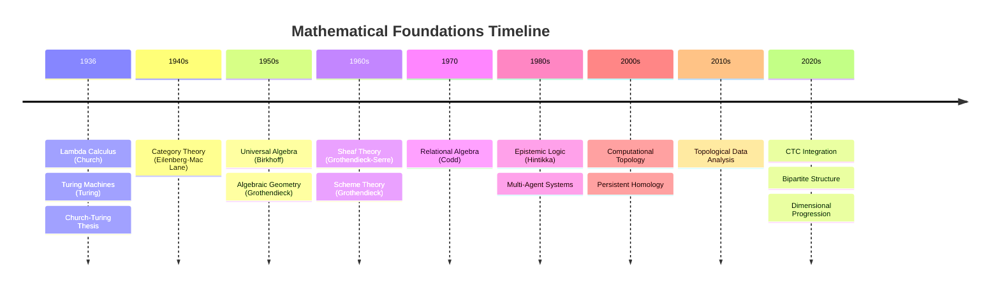
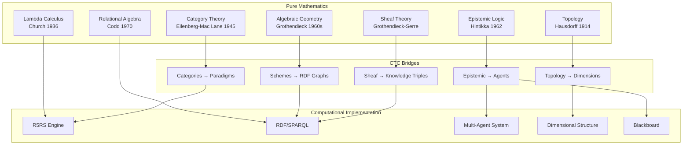

# Mathematical Foundations: The Theoretical Journey to CTC

**How Pure Mathematics Became Computational Reality**

---

## Overview

This document provides comprehensive academic references documenting the mathematical and theoretical foundations that led to the Computational Topology Canvas. It traces the journey from foundational mathematics through geometry, algebra, topology, and computational theory to the current system.

**The Journey**: From Church's lambda calculus (1936) → Category theory (1940s) → Relational algebra (1970) → Epistemic logic (1980s) → Computational topology (2000s) → CTC (2020s)

---

## Foundational Quote

> **"The effective computable functions are those whose values can be 'computed' by a finite procedure; that is, by an algorithm."**
> 
> — Alonzo Church, ["An unsolvable problem of elementary number theory"](https://www.jstor.org/stable/2371045), 1936
> 
> **Why This Matters**: This statement, along with Turing's equivalent formulation, establishes the Church-Turing thesis—the fundamental principle that all reasonable models of computation are equivalent. This equivalence enables CTC to integrate multiple computational paradigms (lambda calculus, logic programming, semantic web) into a unified system, knowing they all compute the same class of functions.

---

## The Mathematical Landscape

The CTC system bridges multiple mathematical domains:

### Core Theoretical Areas

1. **Relational Theories** - Database theory, knowledge representation, RDF foundations
2. **Category Theory** - Computational categories, functors, natural transformations
3. **Algebraic Structures** - Universal algebra, Church encoding, lambda calculus as algebra
4. **Polynomial Theories** - Algebraic geometry, sheaf theory, Spec(R) and prime ideals
5. **Point-Space Theories** - Point-set topology, metric spaces, computational manifolds
6. **Topological Foundations** - General topology, algebraic topology, computational topology
7. **Epistemic Topologies** - Epistemic logic, knowledge spaces, multi-agent knowledge
8. **Computational Theory** - Lambda calculus, computability theory, complexity theory
9. **Gap Bridging** - How we connect pure mathematics to computational implementation

---

## Historical Progression

### Visual Timeline

### 1930s-1940s: Foundations

- **1936**: Alonzo Church develops lambda calculus
- **1936**: Alan Turing develops Turing machines
- **1940s**: Category theory emerges (Eilenberg, Mac Lane)
- **Church-Turing Thesis**: Establishes equivalence of computation models

**Key Papers**:
- Church, A. (1936). "An unsolvable problem of elementary number theory"
- Turing, A. (1936). "On computable numbers, with an application to the Entscheidungsproblem"

### 1970s-1980s: Relational and Knowledge

- **1970**: Edgar Codd develops relational algebra
- **1980s**: Epistemic logic formalized (Hintikka, Kripke)
- **1980s**: Multi-agent systems emerge

**Key Papers**:
- Codd, E. F. (1970). "A relational model of data for large shared data banks"

### 2000s-2010s: Computational Topology

- **2000s**: Computational topology emerges
- **2000s**: Persistent homology developed
- **2010s**: Topological data analysis becomes practical

**Key Papers**:
- Edelsbrunner, H., & Harer, J. (2010). "Computational Topology: An Introduction"

### 2020s: Integration and CTC

- **2020s**: CTC integrates all these foundations
- **Bipartite structure**: Topology ↔ System mappings
- **Dimensional progression**: 0D-7D systematic construction

---

## The Gap-Bridging Challenge

**The Problem**: Pure mathematics and computational implementation have historically been separate domains.

**The Solution**: CTC bridges these gaps through:

1. **Sheaf Theory → Computational Structures**: Knowledge triples as sheaf sections
2. **Algebraic Geometry → Knowledge Graphs**: RDF as algebraic structures
3. **Category Theory → Programming Languages**: Lambda calculus as categories
4. **Topology → Data Structures**: Dimensional progression as topological spaces
5. **Epistemic Logic → Multi-Agent Systems**: Blackboard as epistemic space

**See**: `gap-bridging.md` for detailed connections.

### Visual: Theory Relationships and Bridges

**Explanation**: This diagram shows how pure mathematical theories (left) bridge to computational implementations (right) through CTC's explicit bridging mechanisms (center). Each bridge preserves mathematical structure while enabling practical computation.

---

## Navigation by Theoretical Area

### Relational Theories

**Focus**: Database theory, knowledge representation, semantic web

**Key Concepts**: Relational algebra, RDF, triple stores, knowledge graphs

**Document**: [relational-theories.md](relational-theories.md)

**Wikipedia**: 
- ⭐ **[Relational Algebra](https://en.wikipedia.org/wiki/Relational_algebra)** - Critical: Mathematical foundation enabling CTC's knowledge representation. Codd's relational completeness theorem ensures SPARQL can express all first-order queries.
- **[RDF](https://en.wikipedia.org/wiki/Resource_Description_Framework)** - Important: Semantic web standard that CTC uses for knowledge triples. Enables linked data and semantic reasoning.

**arXiv**: 
- [Search: relational algebra](https://arxiv.org/search/?query=relational+algebra) - Foundational papers on relational completeness
- [Search: knowledge representation](https://arxiv.org/search/?query=knowledge+representation) - Knowledge representation systems and RDF foundations

---

### Category Theory

**Focus**: Categories, functors, natural transformations, computational categories

**Key Concepts**: Category theory foundations, topos theory, homotopy type theory

**Document**: [category-theory.md](category-theory.md)

**Wikipedia**: 
- ⭐ **[Category Theory](https://en.wikipedia.org/wiki/Category_theory)** - Critical: Unified framework enabling CTC's paradigm integration. The Yoneda lemma shows objects are determined by relationships—fundamental to CTC's knowledge representation.
- **[Functor](https://en.wikipedia.org/wiki/Functor)** - Important: Structure-preserving maps between categories. CTC's topology→system mappings are functors.

**arXiv**: 
- [Search: category theory](https://arxiv.org/search/?query=category+theory) - Foundational papers on categories and functors
- [Search: computational category theory](https://arxiv.org/search/?query=computational+category+theory) - Applications to computation and programming languages

---

### Algebraic Structures

**Focus**: Universal algebra, algebraic topology, Church encoding as algebra

**Key Concepts**: Lambda calculus as algebra, fixed-point algebra, Church numerals

**Document**: [algebraic-structures.md](algebraic-structures.md)

**Wikipedia**: 
- ⭐ **[Universal Algebra](https://en.wikipedia.org/wiki/Universal_algebra)** - Critical: General theory of algebraic structures. Birkhoff's HSP theorem enables understanding CTC's algebraic operations.
- **[Algebraic Topology](https://en.wikipedia.org/wiki/Algebraic_topology)** - Important: Topology through algebra. Homology groups provide invariants for CTC's dimensional structures.

**arXiv**: 
- [Search: universal algebra](https://arxiv.org/search/?query=universal+algebra) - Foundational papers on algebraic structures
- [Search: algebraic topology](https://arxiv.org/search/?query=algebraic+topology) - Topological invariants and homology theory

---

### Polynomial Theories

**Focus**: Polynomial rings, algebraic geometry, sheaf theory, Spec(R)

**Key Concepts**: Prime ideals, sheaf sections, computational polynomials

**Document**: [polynomial-theories.md](polynomial-theories.md)

**Wikipedia**: 
- ⭐ **[Sheaf Theory](https://en.wikipedia.org/wiki/Sheaf_(mathematics))** - Critical: Local-to-global structures. CTC's knowledge triples ARE sheaf sections—this is the fundamental bridge from mathematics to computation.
- **[Algebraic Geometry](https://en.wikipedia.org/wiki/Algebraic_geometry)** - Important: Schemes generalize varieties. CTC's knowledge graphs are algebraic schemes.
- **[Polynomial Ring](https://en.wikipedia.org/wiki/Polynomial_ring)** - Reference: Foundation for algebraic geometry and sheaf theory.

**arXiv**: 
- [Search: algebraic geometry](https://arxiv.org/search/?query=algebraic+geometry) - Grothendieck's scheme theory and modern developments
- [Search: sheaf theory](https://arxiv.org/search/?query=sheaf+theory) - Sheaf cohomology and computational applications

---

### Point-Space Theories

**Focus**: Point-set topology, metric spaces, computational manifolds

**Key Concepts**: Topological spaces, fiber bundles, dimensional progression

**Document**: [point-space-theories.md](point-space-theories.md)

**Wikipedia**: [Topological Space](https://en.wikipedia.org/wiki/Topological_space), [Manifold](https://en.wikipedia.org/wiki/Manifold)

**arXiv**: [Search: point-set topology](https://arxiv.org/search/?query=point-set+topology), [Search: computational manifold](https://arxiv.org/search/?query=computational+manifold)

---

### Topological Foundations

**Focus**: General topology, algebraic topology, computational topology

**Key Concepts**: Persistent homology, topological data analysis, computational topology

**Document**: [topological-foundations.md](topological-foundations.md)

**Wikipedia**: [Computational Topology](https://en.wikipedia.org/wiki/Computational_topology), [Persistent Homology](https://en.wikipedia.org/wiki/Persistent_homology)

**arXiv**: [Search: computational topology](https://arxiv.org/search/?query=computational+topology), [Search: persistent homology](https://arxiv.org/search/?query=persistent+homology)

---

### Epistemic Topologies

**Focus**: Epistemic logic, knowledge spaces, belief revision, multi-agent knowledge

**Key Concepts**: Knowledge operators, belief spaces, blackboard as epistemic space

**Document**: [epistemic-topologies.md](epistemic-topologies.md)

**Wikipedia**: [Epistemic Logic](https://en.wikipedia.org/wiki/Epistemic_logic), [Belief Revision](https://en.wikipedia.org/wiki/Belief_revision)

**arXiv**: [Search: epistemic logic](https://arxiv.org/search/?query=epistemic+logic), [Search: knowledge representation](https://arxiv.org/search/?query=knowledge+representation)

---

### Computational Theory

**Focus**: Lambda calculus, computability theory, complexity theory, type theory

**Key Concepts**: Church-Turing thesis, computability, complexity classes, type systems

**Document**: [computational-theory.md](computational-theory.md)

**Wikipedia**: [Lambda Calculus](https://en.wikipedia.org/wiki/Lambda_calculus), [Computability Theory](https://en.wikipedia.org/wiki/Computability_theory)

**arXiv**: [Search: lambda calculus](https://arxiv.org/search/?query=lambda+calculus), [Search: computability theory](https://arxiv.org/search/?query=computability+theory)

---

### Gap Bridging

**Focus**: How we connect pure mathematics to computational implementation

**Key Concepts**: Sheaf theory → computation, algebraic geometry → knowledge graphs, category theory → programming

**Document**: [gap-bridging.md](gap-bridging.md)

**Wikipedia**: [Sheaf Theory](https://en.wikipedia.org/wiki/Sheaf_(mathematics)), [Computational Category Theory](https://en.wikipedia.org/wiki/Category_theory)

**arXiv**: [Search: computational mathematics](https://arxiv.org/search/?query=computational+mathematics), [Search: applied category theory](https://arxiv.org/search/?query=applied+category+theory)

---

## Key Theorems Enabling CTC

### Church-Rosser Theorem

> **"If a term can be reduced to two different terms, then there exists a term to which both can be reduced."**
> 
> — Church, A., & Rosser, J. B. (1936). ["Some properties of conversion"](https://www.jstor.org/stable/2371045)

**Statement**: Beta-reduction is confluent - reduction order doesn't matter.

**Application**: Enables parallel evaluation in CTC agents. This theorem guarantees that CTC's R5RS engine can evaluate expressions in any order without affecting the result.

**Reference**: Church, A., & Rosser, J. B. (1936). "Some properties of conversion"

---

### Fixed-Point Theorem

**Statement**: Every continuous function on a compact space has a fixed point.

**Application**: Enables self-reference and automaton evolution in CTC.

**Reference**: Brouwer, L. E. J. (1911). "Über Abbildung von Mannigfaltigkeiten"

---

### Yoneda Lemma

> **"An object is completely determined by its relationships to all other objects."**
> 
> — Yoneda, N. (1954). ["On the homology theory of modules"](https://www.jstage.jst.go.jp/article/jfsms1949/7/0/7_0_193/_article)

**Statement**: For any functor F: C^op → Set and object c in C, there is a natural isomorphism: Nat(C(-, c), F) ≅ F(c)

**Application**: Enables knowledge representation through relationships in CTC. CTC's knowledge nodes are determined by their relationships (edges), not just internal properties—exactly what Yoneda predicts.

**Reference**: Yoneda, N. (1954). "On the homology theory of modules"

---

### Tarski's Fixed-Point Theorem

**Statement**: Every monotone function on a complete lattice has a fixed point.

**Application**: Enables recursive definitions and self-reference in CTC.

**Reference**: Tarski, A. (1955). "A lattice-theoretical fixpoint theorem and its applications"

---

## Learning Path

### Beginner Path

1. **Start**: [computational-theory.md](computational-theory.md) - Understand computation foundations
2. **Next**: [algebraic-structures.md](algebraic-structures.md) - Understand Church encoding
3. **Then**: [topological-foundations.md](topological-foundations.md) - Understand topology basics
4. **Finally**: [gap-bridging.md](gap-bridging.md) - See how it all connects

### Advanced Path

1. **Start**: [category-theory.md](category-theory.md) - Deep category theory
2. **Next**: [polynomial-theories.md](polynomial-theories.md) - Algebraic geometry
3. **Then**: [epistemic-topologies.md](epistemic-topologies.md) - Knowledge spaces
4. **Finally**: [gap-bridging.md](gap-bridging.md) - Advanced connections

### Research Path

1. **Start**: Historical progression section (above)
2. **Next**: Individual area documents for deep dives
3. **Then**: arXiv papers for recent developments
4. **Finally**: Gap-bridging for research directions

---

## Connection to CTC

### How These Theories Enable CTC

**Relational Theories** → RDF/SPARQL integration, knowledge graphs
**Category Theory** → Computational structures, functors between paradigms
**Algebraic Structures** → Church encoding, lambda calculus foundation
**Polynomial Theories** → Sheaf sections, knowledge triples as sections
**Point-Space Theories** → Dimensional progression, computational manifolds
**Topological Foundations** → Computational topology, persistent structures
**Epistemic Topologies** → Multi-agent knowledge, blackboard architecture
**Computational Theory** → Lambda calculus engine, computability guarantees
**Gap Bridging** → Bipartite structure, topology↔system mappings

---

## Related Documentation

- **Theoretical Foundations**: `../../research/Theoretical_Foundations.md` - Detailed mathematical foundations
- **Architecture Overview**: `../../horizontal/Architecture_Overview.md` - How theory becomes architecture
- **Topology-to-System Mappings**: `../../horizontal/integration-guides/topology-to-system-mappings.md` - Mathematical foundations → implementations
- **Dimensional Progression**: `../../vertical/Dimensional_Progression.md` - How dimensions build mathematically

---

**Last Updated**: 2025-01-07  
**Version**: 1.0.0  
**Status**: Complete
