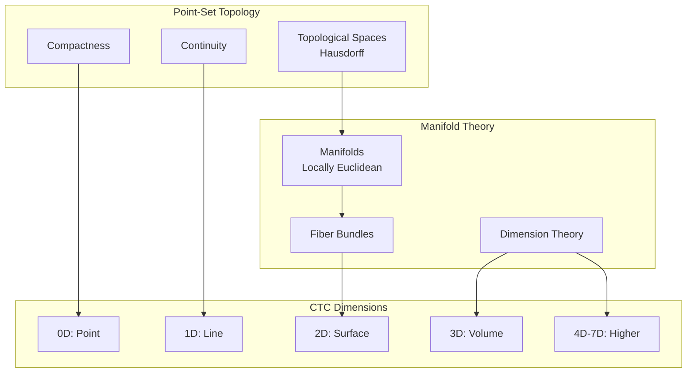

# Point-Space Theories: Topology, Manifolds, and Computational Spaces

**From Point-Set Topology to Computational Manifolds**

---

## Overview

Point-space theories provide the foundation for understanding spaces, manifolds, and dimensional structures. This document covers point-set topology, metric spaces, and how these enable CTC's computational manifolds and dimensional progression from 0D to 7D.

---

## Foundational Quote

> **"Topology is the study of properties that are invariant under continuous transformations."**
> 
> — Felix Hausdorff, ["Grundzüge der Mengenlehre"](https://en.wikipedia.org/wiki/Grundz%C3%BCge_der_Mengenlehre), 1914
> 
> **Why This Matters**: Hausdorff's insight that topology studies invariant properties enables CTC's dimensional structure. Each CTC dimension (0D-7D) is a topological space, and dimensional progression preserves topological invariants. CTC's knowledge structures are topological spaces—their properties (compactness, connectedness) are preserved under continuous transformations, enabling stable knowledge representation.

---

## Historical Context

### 1900s: Point-Set Topology

**Felix Hausdorff** and others developed point-set topology:
- Topological spaces as sets with open sets
- Continuity through open sets
- Compactness and connectedness

**Key Insight**: Many properties depend only on "nearness" structure, not metric.

**Paper**: Hausdorff, F. (1914). "Grundzüge der Mengenlehre"

### 1950s: Manifold Theory

**John Milnor** and others developed modern manifold theory:
- Smooth manifolds
- Fiber bundles
- Differential topology

**Key Insight**: Spaces can be locally Euclidean but globally complex.

**Paper**: Milnor, J. (1956). "On manifolds homeomorphic to the 7-sphere"

### 2000s: Computational Manifolds

- **2000s**: Computational topology emerges
- **2000s**: Manifold learning algorithms
- **2010s**: Topological data analysis

### Visual: Topology → CTC Dimensional Structure

**Explanation**: Point-set topology provides the foundation. CTC's dimensions are topological spaces—0D is a point, 1D is a line (ℝ¹), 2D is a surface (1D × 1D), etc. Fiber bundles enable dimensional progression—each dimension is a bundle over the previous dimension.

---

## Core Theorems

### Tychonoff's Theorem

**Statement**: Product of compact spaces is compact.

**Application**: Enables CTC's dimensional products (e.g., 2D = 1D × 1D).

**Reference**: Tychonoff, A. (1930). "Über die topologische Erweiterung von Räumen"

---

### Brouwer's Fixed-Point Theorem

> **"Every continuous function from a compact convex set to itself has at least one fixed point."**
> 
> — L. E. J. Brouwer, ["Über Abbildung von Mannigfaltigkeiten"](https://link.springer.com/article/10.1007/BF01449207), 1911

**Statement**: Every continuous function from a compact convex set to itself has a fixed point.

**Application**: Enables self-reference and automaton evolution in CTC. CTC's automaton system evolves through continuous transformations, and Brouwer's theorem guarantees fixed points exist—these are the stable states that CTC's evolution converges to.

**Reference**: Brouwer, L. E. J. (1911). "Über Abbildung von Mannigfaltigkeiten"

---

### Whitney Embedding Theorem

**Statement**: Every smooth n-manifold can be embedded in R^(2n).

**Application**: Enables understanding of CTC's dimensional embeddings.

**Reference**: Whitney, H. (1936). "Differentiable manifolds"

---

## Wikipedia References

### Primary Articles

- ⭐ **[Topological Space](https://en.wikipedia.org/wiki/Topological_space)** - **Critical**: Foundation of topology. CTC's dimensions are topological spaces—each dimension (0D-7D) has a topology. This article explains open sets, continuity, and compactness—all essential to understanding CTC's dimensional structure.

- ⭐ **[Manifold](https://en.wikipedia.org/wiki/Manifold)** - **Critical**: Locally Euclidean spaces. CTC's knowledge space is a computational manifold—locally it looks like Euclidean space, but globally it has complex structure. This article explains smooth manifolds and tangent spaces—relevant to CTC's dimensional progression.

- ⭐ **[Fiber Bundle](https://en.wikipedia.org/wiki/Fiber_bundle)** - **Critical**: Spaces fibered over base. CTC's dimensional progression is a sequence of fiber bundles—each dimension is a bundle over the previous dimension. This article explains bundle structure and sections—fundamental to understanding how CTC builds dimensions systematically.

- **[Metric Space](https://en.wikipedia.org/wiki/Metric_space)** - **Important**: Spaces with distance. CTC's knowledge relationships can be understood as distances in metric spaces. Completeness ensures CTC's knowledge structures are well-formed.

### Related Articles

- **[Point-Set Topology](https://en.wikipedia.org/wiki/General_topology)** - General topology
- **[Differential Topology](https://en.wikipedia.org/wiki/Differential_topology)** - Smooth manifolds
- **[Computational Manifold](https://en.wikipedia.org/wiki/Manifold)** - Manifolds in computation
- **[Dimensional Analysis](https://en.wikipedia.org/wiki/Dimensional_analysis)** - Dimension theory

---

## arXiv References

### Foundational Papers

- **Search**: [point-set topology](https://arxiv.org/search/?query=point-set+topology) - Foundational papers
- **Search**: [manifold theory](https://arxiv.org/search/?query=manifold+theory) - Manifold foundations
- **Search**: [fiber bundle](https://arxiv.org/search/?query=fiber+bundle) - Bundle theory
- **Search**: [metric space](https://arxiv.org/search/?query=metric+space) - Metric foundations

### Computational Applications

- **Search**: [computational manifold](https://arxiv.org/search/?query=computational+manifold) - Manifolds in computation
- **Search**: [manifold learning](https://arxiv.org/search/?query=manifold+learning) - Learning on manifolds
- **Search**: [topological data analysis](https://arxiv.org/search/?query=topological+data+analysis) - TDA methods

---

## Connection to CTC

### How Point-Space Theories Enable CTC

**1. Dimensional Progression**
- **0D**: Point topology (single point)
- **1D**: Line topology (ℝ¹)
- **2D**: Surface topology (1D × 1D)
- **3D**: Volume topology (higher products)
- **4D-7D**: Higher-dimensional manifolds

**2. Computational Manifolds**
- **Knowledge Space**: CTC's knowledge as manifold
- **Dimensional Structure**: Each dimension as manifold
- **Fiber Bundles**: Dimensional progression as fiber bundles

**3. Topological Properties**
- **Compactness**: CTC's finite knowledge structures
- **Connectedness**: CTC's connected knowledge graphs
- **Continuity**: CTC's continuous transformations

**4. Metric Structures**
- **Distance**: CTC's knowledge relationships as distances
- **Completeness**: CTC's knowledge completion
- **Convergence**: CTC's automaton evolution convergence

### Specific CTC Applications

**Vertical/Dimensional_Progression.md**:
- 0D → 1D → 2D → ... → 7D progression
- Each dimension as topological space
- Dimensional products (2D = 1D × 1D)

**Topology/{dimension}-topology/**:
- Each dimension agent operates on topological space
- Topological properties of each dimension
- Dimensional relationships

**System/0D-system/Automaton_System.md**:
- Automaton state space as manifold
- Evolution as continuous transformation
- Fixed points as topological fixed points

---

## Prerequisites

**Before understanding point-space theories**:
- Set theory
- Basic analysis
- Linear algebra

**Learning Path**:
1. Set theory → Topological spaces → Manifolds
2. Analysis → Metric spaces → Manifolds
3. Linear algebra → Vector spaces → Manifolds

---

## Enables

**Understanding point-space theories enables**:
- **Topological Foundations**: See `topological-foundations.md` - General topology
- **Algebraic Structures**: See `algebraic-structures.md` - Algebraic topology
- **Gap Bridging**: See `gap-bridging.md` - Topology → computation

---

## Key Concepts

### Topological Spaces

- **Topology**: Collection of open sets
- **Continuity**: Preimage of open set is open
- **Compactness**: Every open cover has finite subcover
- **Connectedness**: Cannot be partitioned into open sets

### Manifolds

- **Manifold**: Locally Euclidean space
- **Chart**: Local coordinate system
- **Atlas**: Collection of charts
- **Tangent Space**: Linear approximation

### Fiber Bundles

- **Base Space**: Space fibers are over
- **Fiber**: Space at each point
- **Total Space**: Union of all fibers
- **Section**: Map from base to total space

---

## Related Theories

- **Topological Foundations**: See `topological-foundations.md` - General topology
- **Algebraic Structures**: See `algebraic-structures.md` - Algebraic topology
- **Polynomial Theories**: See `polynomial-theories.md` - Algebraic geometry
- **Gap Bridging**: See `gap-bridging.md` - Topology → computation

---

**Last Updated**: 2025-01-07  
**Version**: 1.0.0  
**Status**: Complete
