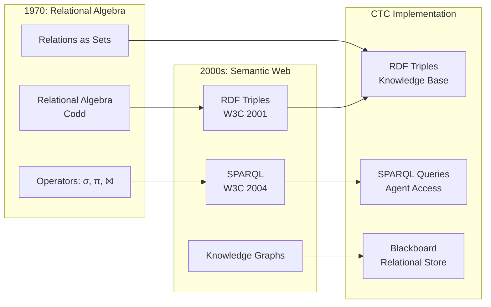

# Relational Theories: Database Foundations and Knowledge Representation

**From Codd's Relational Algebra to Semantic Web Knowledge Graphs**

---

## Overview

Relational theories provide the foundation for structured data representation, database systems, and knowledge graphs. This document covers the mathematical foundations from relational algebra through RDF and semantic web technologies that enable CTC's knowledge representation.

---

## Foundational Quote

> **"Future users of large data banks must be protected from having to know how the data is organized in the machine."**
> 
> — Edgar F. Codd, ["A relational model of data for large shared data banks"](https://dl.acm.org/doi/10.1145/362384.362685), 1970
> 
> **Why This Matters**: Codd's insight that data representation should be independent of physical storage enables CTC's abstract knowledge representation. CTC's RDF triples follow this principle—knowledge is represented relationally, independent of how it's stored or queried. This abstraction enables CTC's blackboard architecture to evolve without breaking knowledge structures.

---

## Historical Context

### 1970: Relational Algebra (Codd)

**Edgar F. Codd** developed relational algebra as a mathematical foundation for database systems, introducing:
- Relations as sets of tuples
- Relational operators (select, project, join, union, etc.)
- Normalization theory
- Relational model of data

**Key Insight**: Data can be represented purely mathematically, independent of physical storage.

**Paper**: Codd, E. F. (1970). "A relational model of data for large shared data banks". Communications of the ACM, 13(6), 377-387.

### 1980s-1990s: Database Theory Development

- **1980s**: Query optimization, transaction theory
- **1990s**: Object-relational databases, XML databases
- **2000s**: Graph databases, NoSQL systems

### 2000s: Semantic Web and RDF

- **2001**: RDF specification (W3C)
- **2004**: SPARQL query language
- **2010s**: Knowledge graphs, linked data

**Key Insight**: Knowledge can be represented as triples (subject-predicate-object), enabling semantic relationships.

### Visual: Relational Theory Evolution

**Explanation**: Relational algebra (1970) evolved into RDF/SPARQL (2000s), which CTC implements. The relational model's mathematical foundation ensures CTC's knowledge representation is complete and queryable.

---

## Core Theorems

### Codd's Relational Completeness

> **"A data sublanguage is relationally complete if and only if it is at least as powerful as the relational algebra."**
> 
> — Edgar F. Codd, ["Relational completeness of data base sublanguages"](https://dl.acm.org/doi/10.1145/356389.356433), 1972

**Statement**: Relational algebra is relationally complete - it can express any query expressible in first-order logic.

**Application**: Enables complete query capabilities in CTC's RDF/SPARQL integration. SPARQL inherits this completeness, ensuring CTC agents can express any first-order query over knowledge graphs.

**Reference**: Codd, E. F. (1972). "Relational completeness of data base sublanguages"

---

### Relational Normalization Theory

**Statement**: Relations can be decomposed into normal forms (1NF, 2NF, 3NF, BCNF) to eliminate redundancy.

**Application**: Guides knowledge graph design and RDF schema organization in CTC.

**Reference**: Codd, E. F. (1971). "Further normalization of the data base relational model"

---

### Triple Store Completeness

**Statement**: RDF triple stores can represent any relational structure through reification.

**Application**: Enables CTC's knowledge representation through RDF triples.

**Reference**: W3C RDF 1.1 Specification (2014)

---

## Wikipedia References

### Primary Articles

- ⭐ **[Relational Algebra](https://en.wikipedia.org/wiki/Relational_algebra)** - **Critical**: Mathematical foundation enabling CTC's knowledge queries. Codd's relational completeness theorem ensures SPARQL can express all first-order queries. Core operators (select, project, join) are the building blocks of CTC's query engine.

- ⭐ **[Resource Description Framework (RDF)](https://en.wikipedia.org/wiki/Resource_Description_Framework)** - **Critical**: Semantic web standard that CTC uses for knowledge triples. The triple model (subject-predicate-object) is CTC's fundamental knowledge representation. This article explains RDF graphs, serialization, and linked data principles—all essential to CTC.

- **[Relational Model](https://en.wikipedia.org/wiki/Relational_model)** - **Important**: Codd's relational model of data. CTC's knowledge graphs follow normalization principles from this model. ACID properties guide CTC's blackboard consistency.

- ⭐ **[SPARQL](https://en.wikipedia.org/wiki/SPARQL)** - **Critical**: RDF query language that CTC agents use to access knowledge. Graph pattern matching enables complex queries over CTC's knowledge graphs. Federated queries enable cross-system knowledge access.

### Related Articles

- **[Database Theory](https://en.wikipedia.org/wiki/Database_theory)** - Theoretical foundations of databases
- **[Knowledge Graph](https://en.wikipedia.org/wiki/Knowledge_graph)** - Graph-based knowledge representation
- **[Triple Store](https://en.wikipedia.org/wiki/Triple_store)** - RDF storage systems
- **[Linked Data](https://en.wikipedia.org/wiki/Linked_data)** - Principles for connecting data
- **[Semantic Web](https://en.wikipedia.org/wiki/Semantic_Web)** - Web of data vision

---

## arXiv References

### Foundational Papers

- **Search**: [relational algebra](https://arxiv.org/search/?query=relational+algebra) - Foundational papers on relational algebra
- **Search**: [database theory](https://arxiv.org/search/?query=database+theory) - Theoretical foundations
- **Search**: [knowledge representation](https://arxiv.org/search/?query=knowledge+representation) - Knowledge representation systems
- **Search**: [RDF semantic web](https://arxiv.org/search/?query=RDF+semantic+web) - RDF and semantic web foundations
- **Search**: [SPARQL query optimization](https://arxiv.org/search/?query=SPARQL+query+optimization) - Query optimization techniques

### Recent Developments

- **Search**: [knowledge graph](https://arxiv.org/search/?query=knowledge+graph) - Knowledge graph research
- **Search**: [graph database](https://arxiv.org/search/?query=graph+database) - Graph database systems
- **Search**: [linked data](https://arxiv.org/search/?query=linked+data) - Linked data applications
- **Search**: [semantic web reasoning](https://arxiv.org/search/?query=semantic+web+reasoning) - Reasoning over RDF

---

## Connection to CTC

### How Relational Theories Enable CTC

**1. Knowledge Representation**
- **RDF Triples**: CTC uses RDF triples for knowledge representation
- **Triple Store**: Blackboard architecture stores facts as RDF triples
- **SPARQL Queries**: Agents query knowledge via SPARQL

**2. Relational Structure**
- **Relations as Knowledge**: CTC's knowledge graphs are relational structures
- **Normalization**: RDF schemas follow normalization principles
- **Query Completeness**: SPARQL provides complete query capabilities

**3. Semantic Relationships**
- **Subject-Predicate-Object**: CTC's knowledge triples follow RDF model
- **Linked Data**: CTC enables linking knowledge across systems
- **Semantic Reasoning**: CTC uses RDF for semantic inference

**4. Database Foundations**
- **ACID Properties**: CTC's blackboard maintains consistency
- **Transaction Theory**: CTC's automaton operations follow transaction principles
- **Query Optimization**: CTC optimizes SPARQL queries for performance

### Specific CTC Applications

**System/3D-system/RDF_SPARQL_Integration.md**:
- RDF triple model implementation
- SPARQL query engine
- Knowledge graph construction

**System/5D-system/Blackboard_Architecture.md**:
- Blackboard as relational knowledge base
- Facts as RDF triples
- Query coordination through SPARQL

**System/2D-system/DataLog_Integration.md**:
- DataLog facts extracted from RDF
- Relational query language
- Bottom-up evaluation

---

## Prerequisites

**Before understanding relational theories**:
- Set theory basics
- First-order logic
- Graph theory fundamentals

**Learning Path**:
1. Set theory → Relations → Relational algebra
2. First-order logic → Database queries → SPARQL
3. Graph theory → Knowledge graphs → RDF

---

## Enables

**Understanding relational theories enables**:
- **Knowledge Graphs**: See `topological-foundations.md` for graph topology
- **Semantic Web**: See `computational-theory.md` for web computation
- **Database Systems**: See `gap-bridging.md` for database-to-computation bridges

---

## Key Concepts

### Relational Operators

- **Select (σ)**: Filter tuples by condition
- **Project (π)**: Select columns
- **Join (⨝)**: Combine relations
- **Union (∪)**: Combine tuple sets
- **Difference (-)**: Remove tuples

### RDF Model

- **Triple**: (subject, predicate, object)
- **Graph**: Set of triples forming a graph
- **URI**: Unique resource identifier
- **Literal**: Data value

### SPARQL Patterns

- **Basic Graph Pattern**: Triple patterns
- **Optional Patterns**: Optional matching
- **Filter Expressions**: Constraint filtering
- **Federated Queries**: Cross-endpoint queries

---

## Related Theories

- **Category Theory**: See `category-theory.md` - Categories of relations
- **Algebraic Structures**: See `algebraic-structures.md` - Relational algebra as algebra
- **Topological Foundations**: See `topological-foundations.md` - Knowledge graphs as topological spaces
- **Gap Bridging**: See `gap-bridging.md` - Relational theory → computation

---

**Last Updated**: 2025-01-07  
**Version**: 1.0.0  
**Status**: Complete
