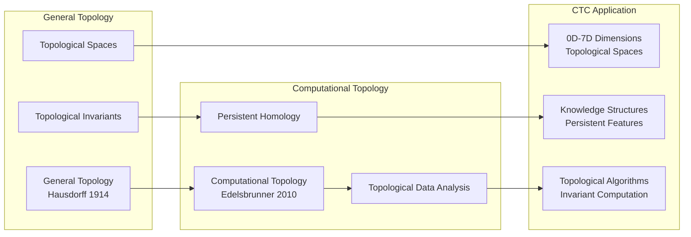

# Topological Foundations: General Topology and Computational Topology

**From General Topology to Computational Applications**

---

## Overview

Topological foundations provide the mathematical structure for understanding spaces, continuity, and computational topology. This document covers general topology, algebraic topology, and computational topology that enable CTC's topological organization and dimensional structure.

---

## Foundational Quote

> **"Computational topology is the algorithmic study of topological invariants of spaces."**
> 
> — Herbert Edelsbrunner & John Harer, ["Computational Topology: An Introduction"](https://www.maths.ed.ac.uk/~v1ranick/papers/edelhare.pdf), 2010
> 
> **Why This Matters**: Edelsbrunner and Harer's definition captures how topology becomes computational. CTC applies computational topology to knowledge structures—persistent homology identifies stable features, topological invariants characterize dimensions, and algorithms compute topological properties. CTC's dimensional structure (0D-7D) is computational topology in action—each dimension has topological invariants that can be computed algorithmically.

---

## Historical Context

### 1900s: General Topology

**Felix Hausdorff** and **Maurice Fréchet** developed general topology:
- Topological spaces
- Separation axioms
- Compactness and connectedness

**Key Insight**: Many properties depend on "nearness" structure, not specific metrics.

**Paper**: Hausdorff, F. (1914). "Grundzüge der Mengenlehre"

### 1940s-1950s: Algebraic Topology

**Samuel Eilenberg** and **Norman Steenrod** systematized algebraic topology:
- Homology and cohomology
- Fundamental groups
- Spectral sequences

**Key Insight**: Topological invariants can be computed algebraically.

**Paper**: Eilenberg, S., & Steenrod, N. (1952). "Foundations of algebraic topology"

### 2000s: Computational Topology

**Herbert Edelsbrunner** and others developed computational topology:
- Persistent homology
- Topological data analysis
- Algorithms for topology

**Key Insight**: Topology can be computed and applied to data.

**Paper**: Edelsbrunner, H., & Harer, J. (2010). "Computational Topology: An Introduction"

### Visual: Topology → Computational Topology → CTC

**Explanation**: General topology provides the foundation. Computational topology makes topology algorithmic. CTC applies computational topology to knowledge structures—dimensions are topological spaces, knowledge has persistent features, and algorithms compute topological invariants.

---

## Core Theorems

### Brouwer's Fixed-Point Theorem

**Statement**: Every continuous function from a compact convex set to itself has a fixed point.

**Application**: Enables self-reference and automaton evolution in CTC.

**Reference**: Brouwer, L. E. J. (1911). "Über Abbildung von Mannigfaltigkeiten"

---

### Hurewicz Theorem

**Statement**: Relates homotopy groups to homology groups.

**Application**: Enables understanding of CTC's dimensional structure through homology.

**Reference**: Hurewicz, W. (1936). "Beiträge zur Topologie der Deformationen"

---

### Persistent Homology Stability

> **"Small changes in data produce small changes in persistent homology—topological features are stable under noise."**
> 
> — Cohen-Steiner, D., Edelsbrunner, H., & Harer, J. (2007). ["Stability of persistence diagrams"](https://link.springer.com/article/10.1007/s00454-006-1276-5)

**Statement**: Small changes in data produce small changes in persistent homology.

**Application**: Enables stable knowledge structures in CTC. CTC's knowledge graphs have persistent topological features that remain stable as knowledge evolves—this stability theorem guarantees that CTC's knowledge representation is robust to small changes.

**Reference**: Cohen-Steiner, D., Edelsbrunner, H., & Harer, J. (2007). "Stability of persistence diagrams"

---

## Wikipedia References

### Primary Articles

- ⭐ **[Computational Topology](https://en.wikipedia.org/wiki/Computational_topology)** - **Critical**: Computing topology. CTC applies computational topology to knowledge structures. This article explains persistent homology, topological data analysis, and algorithms—all essential to understanding how CTC computes topological properties of knowledge.

- ⭐ **[Persistent Homology](https://en.wikipedia.org/wiki/Persistent_homology)** - **Critical**: Stable topological features. CTC's knowledge structures have persistent features that remain stable as knowledge evolves. This article explains persistence diagrams, barcodes, and stability—fundamental to CTC's robust knowledge representation.

- ⭐ **[General Topology](https://en.wikipedia.org/wiki/General_topology)** - **Critical**: Point-set topology foundation. CTC's dimensions are topological spaces. This article explains topological spaces, continuity, and compactness—all essential to understanding CTC's dimensional structure.

- **[Algebraic Topology](https://en.wikipedia.org/wiki/Algebraic_topology)** - **Important**: Topology through algebra. Homology groups provide invariants for CTC's dimensional structures. This article explains how algebraic methods analyze topology—relevant to CTC's dimensional progression.

### Related Articles

- **[Homology (Mathematics)](https://en.wikipedia.org/wiki/Homology_(mathematics))** - Homology theory
- **[Cohomology](https://en.wikipedia.org/wiki/Cohomology)** - Dual of homology
- **[Topological Data Analysis](https://en.wikipedia.org/wiki/Topological_data_analysis)** - TDA methods
- **[Simplicial Complex](https://en.wikipedia.org/wiki/Simplicial_complex)** - Combinatorial topology

---

## arXiv References

### Foundational Papers

- **Search**: [general topology](https://arxiv.org/search/?query=general+topology) - Foundational papers
- **Search**: [algebraic topology](https://arxiv.org/search/?query=algebraic+topology) - Algebraic topology
- **Search**: [computational topology](https://arxiv.org/search/?query=computational+topology) - Computational topology
- **Search**: [persistent homology](https://arxiv.org/search/?query=persistent+homology) - Persistent homology

### Recent Developments

- **Search**: [topological data analysis](https://arxiv.org/search/?query=topological+data+analysis) - TDA research
- **Search**: [computational homology](https://arxiv.org/search/?query=computational+homology) - Computing homology
- **Search**: [topological machine learning](https://arxiv.org/search/?query=topological+machine+learning) - ML with topology

---

## Connection to CTC

### How Topological Foundations Enable CTC

**1. Computational Topology**
- **Dimensional Structure**: CTC's 0D-7D structure is computational topology
- **Topological Invariants**: CTC's knowledge structures have topological invariants
- **Persistent Features**: CTC's stable knowledge features

**2. Algebraic Topology**
- **Homology**: CTC's dimensional structure has homology groups
- **Cohomology**: CTC's knowledge relationships as cohomology
- **Fundamental Groups**: CTC's knowledge loops

**3. General Topology**
- **Topological Spaces**: Each CTC dimension is topological space
- **Continuity**: CTC's transformations are continuous
- **Compactness**: CTC's finite knowledge structures

**4. Topological Data Analysis**
- **Persistence**: CTC's knowledge persistence
- **Stability**: CTC's stable knowledge structures
- **Algorithms**: CTC's topological algorithms

### Specific CTC Applications

**System Name**: Computational Topology Canvas
- **Topology**: Mathematical foundation
- **Computational**: Implementation
- **Canvas**: Knowledge representation

**Vertical/Dimensional_Progression.md**:
- Topological progression: 0D → 1D → 2D → ... → 7D
- Each dimension as topological space
- Dimensional relationships as topological maps

**Topology/{dimension}-topology/**:
- Each dimension agent operates on topological space
- Topological properties of knowledge
- Dimensional topology

---

## Prerequisites

**Before understanding topological foundations**:
- Set theory
- Basic analysis
- Group theory (for algebraic topology)

**Learning Path**:
1. Set theory → Topological spaces → General topology
2. Group theory → Homology → Algebraic topology
3. Algorithms → Persistent homology → Computational topology

---

## Enables

**Understanding topological foundations enables**:
- **Point-Space Theories**: See `point-space-theories.md` - Manifolds and spaces
- **Algebraic Structures**: See `algebraic-structures.md` - Algebraic topology
- **Gap Bridging**: See `gap-bridging.md` - Topology → computation

---

## Key Concepts

### General Topology

- **Topological Space**: Set with topology (open sets)
- **Continuity**: Preimage of open set is open
- **Compactness**: Every open cover has finite subcover
- **Connectedness**: Cannot be partitioned into open sets

### Algebraic Topology

- **Homology**: Algebraic invariant measuring "holes"
- **Cohomology**: Dual of homology
- **Fundamental Group**: Group of loops
- **Homotopy**: Continuous deformation

### Computational Topology

- **Persistent Homology**: Stable topological features
- **Persistence Diagram**: Visualization of features
- **Barcode**: Alternative visualization
- **Stability**: Robustness to noise

---

## Related Theories

- **Point-Space Theories**: See `point-space-theories.md` - Manifolds
- **Algebraic Structures**: See `algebraic-structures.md` - Algebraic topology
- **Polynomial Theories**: See `polynomial-theories.md` - Algebraic geometry
- **Gap Bridging**: See `gap-bridging.md` - Topology → computation

---

**Last Updated**: 2025-01-07  
**Version**: 1.0.0  
**Status**: Complete
